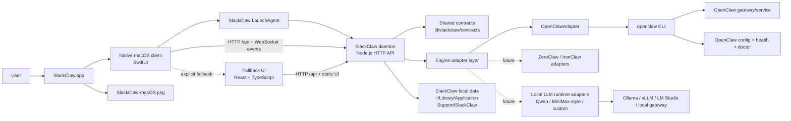

# ChillClaw

ChillClaw is a macOS-first, local-first desktop product that makes OpenClaw usable for non-technical users. This repository currently contains:

- a React + TypeScript desktop UI for deploy, configuration, task routing, health, and recovery
- a local TypeScript daemon with an engine adapter seam
- an `OpenClawAdapter` implementation that manages deploy targets, model entries, channels, chat sessions, updates, and gateway health
- shared contracts for deployment, model/channel management, AI members, chat, onboarding, task execution, recovery, and updates

## Workspace layout

- `apps/desktop-ui`: React UI for install, onboarding, tasks, health, and recovery
- `apps/daemon`: local API and orchestration layer
- `packages/contracts`: shared domain types and defaults
- `docs/adr`: architecture decisions for v0.1
- `docs/reference`: operator and developer reference notes

## Current state

This is an active MVP implementation, not a blank scaffold. It intentionally keeps the engine abstraction narrow and the first-party UX opinionated.

The desktop shell is implemented as a web UI + local daemon boundary so a Tauri wrapper can be added once the Rust toolchain is available in the target environment.

## What Works Today

- Deploy page:
  - detects installed OpenClaw runtimes on the current Mac
  - separates installed targets from installable targets
  - supports install, update, and uninstall flows for the current OpenClaw targets
  - shows current and latest version information
- Configuration page:
  - shows the live OpenClaw runtime model chain and SlackClaw-managed configured model records
  - supports model add/edit flows
  - supports default and fallback model selection
  - stages model, channel, skill, and workspace configuration changes immediately without requiring the gateway to be running
  - returns explicit pending-apply state when saved configuration still needs the gateway to reload
  - falls back to direct OpenClaw config writes for known CLI command drift on safe config-backed mutations
- Channel setup:
  - supports Telegram, WhatsApp, Feishu, and a WeChat workaround path
  - keeps command-first setup behavior, with config-backed recovery for known safe command drift cases
- Onboarding:
  - uses a daemon-backed full-screen onboarding flow at `/onboarding`
  - persists draft onboarding progress through the daemon so refreshes resume the current step
  - wires install, permissions, model setup, channel setup, and AI employee creation to the real ChillClaw daemon flows instead of mock state
  - uses daemon-owned onboarding UI config so the curated model and channel choices stay aligned across clients
  - documents both the current seven-step implementation and the target six-step onboarding contract in [docs/reference/onboarding-design.md](/Users/home/Ryo/Projects/slackclaw/docs/reference/onboarding-design.md)
- Chat page:
  - supports real multi-thread chat with AI members backed by OpenClaw agents
  - creates or reuses chat threads per AI member
  - loads history through the daemon and streams updates back into the UI
- AI members:
  - create or reuse one real OpenClaw agent per member
  - seed each member with an isolated workspace containing personalized identity, soul, user, tool, memory, and bootstrap files plus per-agent folders such as `knowledge/`, `memory/`, `skills/`, `notes/`, and `deliverables/`
  - stage agent config and per-agent workspace changes without forcing a gateway restart during save
- Developer workflow:
  - includes an engine compatibility test runner for evaluating future OpenClaw versions
  - includes co-located tests for compatibility-sensitive adapter, service, contract, and UI logic

## System structure

### Runtime breakdown

- `SlackClaw.app` is now a native SwiftUI client that talks only to the local SlackClaw daemon.
- In the packaged app, the daemon is intended to run under a per-user macOS `LaunchAgent` instead of a one-off background shell process.
- The daemon serves the `/api` endpoints and still serves the built React frontend assets as an explicit fallback surface.
- UI clients use HTTP for commands and authoritative reads, plus one daemon WebSocket endpoint at `/api/events` for push updates.
- The old dedicated `/api/chat/events` client stream is retired; chat now rides the same shared daemon event channel as deploy, gateway, and config updates.
- The React overview, deploy, AI-team, onboarding, and chat surfaces now consume the daemon event bus for incremental refresh instead of relying only on manual polling or page-local SSE.
- The native macOS app state, native onboarding flow, and native chat transport all listen to the shared daemon event bus so overview, step-scoped onboarding data, active sections, and live chat transcript updates reconcile through one WebSocket channel.
- The daemon owns the OpenClaw gateway socket internally for chat and runtime behavior instead of exposing that socket to clients.
- The daemon-side platform layer now owns explicit filesystem/state, CLI runner, gateway socket, and secrets seams, including a macOS keychain-backed secrets adapter for mirrored user-entered credentials.
- Read-only OpenClaw CLI reads are cached and coalesced inside the daemon per logical refresh cycle so one page load does not fan out into repeated duplicate CLI calls.
- The engine seam lives behind `EngineAdapter`, so SlackClaw product logic does not talk to OpenClaw directly.
- `EngineAdapter` is now the composed manager boundary itself rather than a second public flat method bag on top of those managers.
- `EngineAdapter` is now a composed facade over four engine-neutral managers:
  - `instances`: install, uninstall, update, and runtime detection
  - `config`: models, channels, skills, instance workspace, and web-tool policy
  - `aiEmployees`: OpenClaw agent-backed AI employee config and workspace management
  - `gateway`: live gateway lifecycle, health, tasks, chat, login, and pairing flows
- Config and AI employee saves are staged changes. They write correct engine and workspace state first, then the gateway manager is responsible for applying them live.
- `OpenClawAdapter` checks for an existing OpenClaw install, reuses it when available, and otherwise deploys a SlackClaw-managed local OpenClaw runtime under the user's SlackClaw data directory.
- The adapter seam is intentionally future-facing: it should later support local-LLM runtimes and model families such as Qwen, MiniMax-exposed local runtimes, Llama, Mistral, and other OpenAI-compatible local gateways.
- User state, diagnostics, and SlackClaw metadata live in `~/Library/Application Support/SlackClaw` when packaged.

### Packaging breakdown

- `SlackClaw-macOS.pkg` installs `SlackClaw.app` into `/Applications`.
- The app bundle contains the native macOS client, the built fallback React UI, the daemon, LaunchAgent helper scripts, and OpenClaw bootstrap/install logic.
- OpenClaw itself is reused when an existing install is already available, or deployed into SlackClaw-managed local app data when setup needs to install it.

### Native macOS client

SlackClaw now includes a daemon-backed native macOS client with:

- `apps/macos-native`: SwiftUI app shell and native product screens
- `apps/shared/SlackClawKit`: native protocol models, daemon HTTP/WebSocket client layers, and reusable chat UI/view models
- the same seven-step daemon-backed onboarding gate as the React client, shown before the main native shell until first-run setup is fully completed
- the same daemon-owned onboarding config for curated provider and channel selection, so React and native steps 4 and 5 stay aligned to one source of truth
  - onboarding curated provider/channel metadata uses `platformUrl` for platform destinations, `docsUrl` for documentation links, and `tutorialVideoUrl` for optional in-app tutorial video modals

The native client is the packaged default. The React UI remains in the repo and in the app bundle as:

- the fallback UI if native recovery needs a web surface
- the primary developer UI during local browser-based development
- a parity reference while native and React stay aligned to the same daemon APIs

## Languages

The first-party UI currently supports:

- English
- Chinese
- Japanese
- Korean
- Spanish

Language selection is handled in the frontend and stored locally in the browser.

## Future adapter direction

SlackClaw should remain able to support more than OpenClaw.

- Keep the current `EngineAdapter` boundary as the only place where engine-specific logic is allowed.
- Future adapters may target local-LLM runtimes, including model families such as Qwen and other self-hosted stacks exposed through Ollama, vLLM, LM Studio, or compatible local gateways.
- MiniMax-style support should be added through an adapter or local gateway compatibility layer, not by hard-coding provider assumptions into the product UI.
- The product layer should continue to care about install, lifecycle, health, tasks, updates, and recovery, not about model-specific wire formats.

## Quick start

1. Install dependencies with `npm install`
2. Start the full local test stack with `npm start`
3. Stop the full local test stack with `npm stop`
4. Restart the full local test stack with `npm restart`

The daemon defaults to `http://127.0.0.1:4545`.

### What `npm start` does

- checks that local Node dependencies already exist
- skips OpenClaw bootstrap so local dev startup does not install or modify the engine automatically
- builds the shared contracts and daemon before launching them
- starts the daemon and waits for port `4545` to open
- starts the UI and waits for port `4173` to open
- fails early if either expected port is already occupied
- records the managed daemon and UI process IDs in `.data/dev-processes.json`
- prints numbered, step-by-step console output so local development startup progress is visible
- keeps both processes attached to the same terminal session so `Ctrl+C` shuts them down together

### What `npm stop` does

- reads `.data/dev-processes.json`
- stops the managed SlackClaw daemon and UI process groups
- clears the tracked dev-process state file

### What `npm restart` does

- runs the managed `npm stop` flow first
- then runs the managed `npm start` flow
- gives you a one-command way to recycle the local daemon and UI without changing the existing startup path

If you still want to run pieces separately for debugging:

1. `npm run dev:daemon`
2. `npm run dev:ui`
3. optionally run `npm run bootstrap:openclaw` if you want to prepare OpenClaw ahead of time instead of using the in-product install flow

For the exact upstream OpenClaw commands SlackClaw uses for install, models, channels, agents, and chat, see [docs/reference/openclaw-commands.md](/Users/home/Ryo/Projects/slackclaw/docs/reference/openclaw-commands.md).

## Engine compatibility workflow

SlackClaw now includes a developer-only engine compatibility runner for evaluating new OpenClaw versions before SlackClaw adopts them.

- Run the normal static checks first:
  - `npm run build`
  - `npm run test`
- Run the compatibility matrix:
  - `npm run test:engine-compat`
  - `npm run test:engine-compat -- --candidate-version 2026.3.11`
  - `npm run test:engine-compat -- --runtime managed --candidate-version 2026.3.11`

What the compatibility runner does:

- creates isolated temporary `HOME` and SlackClaw data directories so it does not reuse your normal config by default
- checks both runtime modes SlackClaw supports today:
  - an existing system OpenClaw install
  - a SlackClaw-managed self-contained runtime
- uses the same bootstrap script SlackClaw uses for managed installs
- writes a machine-readable JSON report and a Markdown summary under `.data/engine-compatibility/...`
- records capability-by-capability pass/fail/not-supported status plus the likely SlackClaw source files to update when something breaks

Notes:

- The system-runtime lane only runs against whatever `openclaw` version is already installed on your machine. If you pass `--candidate-version` and the system install is on a different version, that lane is skipped and reported clearly.
- The managed-runtime lane can bootstrap a candidate version into an isolated SlackClaw data directory by using `--candidate-version`.
- Task execution is skipped unless you set `SLACKCLAW_COMPAT_RUN_TASK=1` and provide real credentials the candidate runtime can use.
- Compatibility fixtures for parser drift live under `apps/daemon/src/engine/__fixtures__/openclaw/`.

## Current first-run app flow

When a user installs and opens ChillClaw for the first time today:

1. ChillClaw opens a seven-step onboarding flow at `/onboarding`.
2. `Welcome` initializes the guided setup and stores onboarding draft progress in the daemon-backed state store.
3. `Install OpenClaw` checks whether a compatible runtime already exists on the Mac, reuses it when possible, and deploys the latest available managed runtime when it is missing.
4. `Permissions` guides the user through the macOS capabilities ChillClaw may need and reuses the same permissions UI that appears in Settings.
5. `Configure Model` saves the first real model entry and handles any interactive provider auth through the daemon.
6. `Configure Channel` saves one launch channel configuration for WeChat, Feishu, or Telegram without requiring the gateway to be running yet.
7. `Create AI Employee` creates the first real OpenClaw-backed AI employee using the selected onboarding model.
8. `Complete` shows an authoritative summary and lets the user continue to `AI Team`, `Dashboard`, or `Chat`.

ChillClaw only marks first-run setup complete after the final onboarding step. If setup was not completed, ChillClaw resumes the onboarding flow instead of dropping the user straight into the main workspace.

## Target onboarding contract

The product is converging on a simpler six-step guided flow with one final apply point:

1. `Welcome`
2. `Detect Runtime`: detect install state, offer install when missing, and offer update when a managed update is available
3. `Permissions`: persist and enforce the permissions gate before unlocking the next step
4. `Configure First Model`: show only the three curated onboarding providers and save model auth/config only
5. `Configure First Channel`: show only the curated onboarding channels and save channel config only
6. `Create AI Employee`: let the user pick a preset and enter name/title, then create the first AI employee and apply all staged runtime changes once

The detailed current-vs-target sequence diagrams, invariants, and implementation gaps live in [docs/reference/onboarding-design.md](/Users/home/Ryo/Projects/slackclaw/docs/reference/onboarding-design.md).

### Onboarding design baseline

Onboarding screens follow a centered macOS setup layout rather than a full-width web-app layout.

- main content width should follow `clamp(windowWidth × 0.70, 672, 1120)`
- step-1 welcome card height should follow `clamp(contentWidth ÷ 1.74, 520, 616)` to avoid an oversized vertical canvas on normal desktop windows
- header/logo text should stay capped at `768px` or `73%` of the content width
- the ideal content aspect ratio is about `1.618 : 1`
- onboarding uses the system font stack with a semantic scale centered on `34/40` hero text, `16/24` body copy, and `12/16` progress/meta text
- onboarding spacing and shapes follow an 8-point grid with `32` outer padding, `24` feature-card padding, `24` outer radius, `16` feature-card radius, and `48–52px` primary CTA height
- native onboarding windows default to `1280 × 860`, stay resizable, and use `960 × 720` as the minimum size

For the full reference, see [docs/reference/onboarding-design.md](/Users/home/Ryo/Projects/slackclaw/docs/reference/onboarding-design.md).

## Channel setup

After OpenClaw is deployed, SlackClaw exposes a guided channel setup panel in the UI:

- `Telegram`: saves a bot token with `openclaw channels add --channel telegram --token ...`, then approves the first pairing code.
- `WhatsApp`: starts `openclaw channels login --channel whatsapp --verbose`, streams the session output into SlackClaw, then approves the pairing code.
- `Feishu`: prepares the official plugin when needed, saves Feishu credentials into OpenClaw, and guides pairing.
- `WeChat workaround`: installs and enables a community WeCom-style plugin path, saves the workaround config, and clearly marks this path as experimental rather than official OpenClaw support.
- `Gateway apply / restart`: after config changes are staged, SlackClaw uses the gateway manager to restart and verify the gateway so all configured channels load together.

When the OpenClaw CLI drifts in known ways for config-backed mutations, SlackClaw now tries the normal command first and then falls back to writing the equivalent OpenClaw config directly. The gateway manager then applies those staged changes live. This currently covers:

- Telegram channel config save and removal
- Feishu channel config save and removal
- WeChat workaround config save and removal
- default-model config writes

SlackClaw now also exposes an explicit `Deploy OpenClaw locally` action in the first-run setup page and the install panel. That path forces deployment into SlackClaw's managed local runtime instead of merely reusing a compatible system OpenClaw.
The service panel also now exposes app-level controls to stop the local SlackClaw daemon and uninstall the packaged app's managed service/data.

## Model management

SlackClaw manages AI models in two related ways:

- `Current OpenClaw runtime`: the active default + fallback model chain reported by the installed OpenClaw runtime
- `Configured models`: SlackClaw-managed model records that preserve provider choice, auth method, and display metadata for switching runtime behavior

Current behavior:

- normal configured entries stay as SlackClaw metadata until promoted to default or fallback
- provider auth uses the OpenClaw `models auth` command family instead of creating helper model agents
- if OpenClaw is changed outside SlackClaw, SlackClaw reconciles the active runtime chain back into the model overview so the UI stays truthful
- duplicate configured entries for the same model can exist, but only one copy of a model can be active in the runtime chain at a time
- for safe model-chain mutations such as setting the default model, SlackClaw can fall back to direct config writes if the CLI command shape drifts
- model and channel saves can succeed even while the gateway is stopped, because the gateway manager is now the only live-apply boundary

## Chat management

SlackClaw now exposes a real `/chat` workspace instead of a placeholder route.

- each chat thread belongs to one AI member and therefore one OpenClaw agent
- the desktop UI talks only to the SlackClaw daemon for chat creation, history, send, and abort actions
- the daemon bridges those requests into the OpenClaw gateway chat/session methods and keeps a daemon-owned live gateway event bridge open for chat runs
- live assistant updates are pushed back to the UI with server-sent events, not browser-direct OpenClaw connections
- the chat workspace is designed as a Telegram-like threaded conversation surface with optimistic user bubbles, thinking indicators, tool-activity labels, in-place assistant streaming, and multi-thread AI member switching

## AI member workspaces

When SlackClaw creates a new AI member, it also seeds that OpenClaw agent's workspace with a richer first-run scaffold:

- `IDENTITY.md`, `SOUL.md`, `USER.md`, `AGENTS.md`, `TOOLS.md`, `MEMORY.md`, `HEARTBEAT.md`, and `BOOT.md`
- `BOOTSTRAP.md` for brand-new workspaces only
- per-agent folders such as `knowledge/`, `memory/`, `skills/`, `notes/`, `briefs/`, `deliverables/`, and `scratch/`
- a dated daily memory note under `memory/YYYY-MM-DD.md`

This keeps each OpenClaw agent isolated and closer to the multi-agent workspace pattern described in the OpenClaw docs.

### Local OpenClaw deployment

- Packaged SlackClaw prefers an existing `openclaw` install if one is already available.
- If no install is found, SlackClaw deploys `openclaw@latest` into `~/Library/Application Support/SlackClaw/data/openclaw-runtime`.
- Existing OpenClaw installs are reused when they are compatible, but SlackClaw now still normalizes the OpenClaw gateway baseline before treating that runtime as ready.
- During install or reuse, SlackClaw forces the OpenClaw gateway config back to SlackClaw's safe local baseline: `gateway.mode=local`, `gateway.bind=loopback`, token auth enabled, existing token preserved when present, and inherited `gateway.remote` overrides removed.
- Once that managed runtime exists, SlackClaw prefers it over an incompatible system-level OpenClaw.
- If the user clicks `Deploy OpenClaw locally`, SlackClaw deploys the managed local runtime even when a compatible system OpenClaw already exists.
- If `npm` is missing but Homebrew is available, SlackClaw now tries to install the needed `node`/`npm` toolchain and `git` through Homebrew before retrying local OpenClaw deployment.
- If neither `npm` nor Homebrew is available, setup fails with a direct prerequisite message instead of pretending installation succeeded.
- UI install/setup errors now surface the daemon's real error message instead of only showing a generic HTTP status.

## macOS installer

Build a distributable macOS app bundle and installer package with:

`npm run build:mac-installer`

Build only the native macOS client executable with:

`npm run build:mac-native`

Run the native Swift package tests with:

`npm run test:mac-native`

Open the native macOS client package in Xcode with:

`open -a Xcode apps/macos-native/Package.swift`

Then choose the `SlackClawNative` scheme, select `My Mac`, and press Run.

Open the shared Swift package in a separate Xcode window when needed:

`open -a Xcode apps/shared/SlackClawKit/Package.swift`

React remains a parallel app under `apps/desktop-ui`, and future native clients such as `apps/windows-native` should stay parallel to `apps/macos-native`.

This produces:

- `dist/macos/SlackClaw-macOS.pkg`

The installer builder stages the `.app` bundle in a temporary directory under `dist/`, then packages a native SwiftUI `SlackClaw.app` that talks to the bundled self-contained `slackclaw-daemon`.
The packaged SlackClaw daemon still does not depend on a separate Homebrew-style Node runtime on the target Mac.

The packaged app also includes LaunchAgent helper scripts so SlackClaw can run as a login-time background service on macOS.
The native client first tries to attach to an already-running daemon, then installs or refreshes the LaunchAgent if needed, and falls back to the bundled web UI only as an explicit recovery path.
On cold start, the native client loads the daemon overview first and then lazily hydrates the active section instead of fan-out loading every major page endpoint in parallel.
Managed-local OpenClaw installs now refresh runtime-command detection after npm deploys the CLI, and the native client uses an extended timeout for long-running first-run setup and deploy/install requests so real installs are less likely to fail as client-side timeouts.

Packaged app logs live under:

- `~/Library/Application Support/SlackClaw/logs/daemon.log`

## App controls

- `Stop SlackClaw` stops the local daemon and leaves the native app ready to reconnect or reopen the fallback web UI if needed.
- `Uninstall SlackClaw` stops the daemon, removes the LaunchAgent, removes SlackClaw-managed local data, and removes the packaged app bundle when running from the packaged macOS app.
- `Remove service` only uninstalls the LaunchAgent. It does not uninstall the app or delete SlackClaw data.
