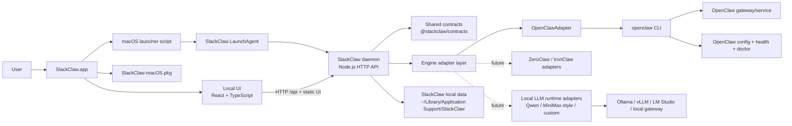

# SlackClaw

SlackClaw is a macOS-first, local-first desktop product that makes OpenClaw usable for non-technical users. This repository currently contains:

- a React + TypeScript desktop UI scaffold
- a local TypeScript daemon with an engine adapter seam
- a first `OpenClawAdapter` implementation with a safe mock fallback
- shared contracts for health, onboarding, task execution, recovery, and updates

## Workspace layout

- `apps/desktop-ui`: React UI for install, onboarding, tasks, health, and recovery
- `apps/daemon`: local API and orchestration layer
- `packages/contracts`: shared domain types and defaults
- `docs/adr`: architecture decisions for v0.1

## Current state

This is an MVP scaffold designed to validate the SlackClaw product shape. It intentionally keeps the engine abstraction narrow and the first-party UX opinionated.

The desktop shell is implemented as a web UI + local daemon boundary so a Tauri wrapper can be added once the Rust toolchain is available in the target environment.

## System structure

### Runtime breakdown

- `SlackClaw.app` is a lightweight launcher that ensures the SlackClaw LaunchAgent is installed, then opens the UI.
- In the packaged app, the daemon is intended to run under a per-user macOS `LaunchAgent` instead of a one-off background shell process.
- The daemon serves both the `/api` endpoints and the built frontend assets when packaged.
- The engine seam lives behind `EngineAdapter`, so SlackClaw product logic does not talk to OpenClaw directly.
- `OpenClawAdapter` checks for an existing pinned OpenClaw install, reuses it when compatible, and otherwise deploys a SlackClaw-managed local OpenClaw runtime under the user's SlackClaw data directory.
- The adapter seam is intentionally future-facing: it should later support local-LLM runtimes and model families such as Qwen, MiniMax-exposed local runtimes, Llama, Mistral, and other OpenAI-compatible local gateways.
- User state, diagnostics, and SlackClaw metadata live in `~/Library/Application Support/SlackClaw` when packaged.

### Packaging breakdown

- `SlackClaw-macOS.pkg` installs `SlackClaw.app` into `/Applications`.
- The app bundle contains the built UI, daemon, LaunchAgent helper scripts, and OpenClaw bootstrap/install logic.
- OpenClaw itself is reused when a compatible install already exists, or deployed into SlackClaw-managed local app data when setup needs to install it.

## Languages

The first-party UI currently supports:

- English
- Chinese
- Japanese
- Korean
- Spanish

Language selection is handled in the frontend and stored locally in the browser.

## Future adapter direction

SlackClaw should remain able to support more than OpenClaw.

- Keep the current `EngineAdapter` boundary as the only place where engine-specific logic is allowed.
- Future adapters may target local-LLM runtimes, including model families such as Qwen and other self-hosted stacks exposed through Ollama, vLLM, LM Studio, or compatible local gateways.
- MiniMax-style support should be added through an adapter or local gateway compatibility layer, not by hard-coding provider assumptions into the product UI.
- The product layer should continue to care about install, lifecycle, health, tasks, updates, and recovery, not about model-specific wire formats.

## Quick start

1. Install dependencies with `npm install`
2. Start the full local test stack with `npm start`
3. Stop the full local test stack with `npm stop`

The daemon defaults to `http://127.0.0.1:4545`.

### What `npm start` does

- checks that local Node dependencies already exist
- runs `npm run bootstrap:openclaw` and waits for it to finish
- builds the shared contracts and daemon before launching them
- starts the daemon and waits for port `4545` to open
- starts the UI and waits for port `4173` to open
- fails early if either expected port is already occupied
- records the managed daemon and UI process IDs in `.data/dev-processes.json`
- keeps both processes attached to the same terminal session so `Ctrl+C` shuts them down together

### What `npm stop` does

- reads `.data/dev-processes.json`
- stops the managed SlackClaw daemon and UI process groups
- clears the tracked dev-process state file

If you still want to run pieces separately for debugging:

1. `npm run bootstrap:openclaw`
2. `npm run dev:daemon`
3. `npm run dev:ui`

## First-run app flow

When a user installs and opens SlackClaw for the first time:

1. SlackClaw shows an intro page once.
2. After `Get started`, SlackClaw opens a first-run setup page.
3. The setup flow checks whether OpenClaw already exists on the Mac.
4. If OpenClaw already exists, SlackClaw reuses it and tries to make sure the service is running.
5. If OpenClaw is missing or incompatible, SlackClaw deploys the pinned OpenClaw runtime into `~/Library/Application Support/SlackClaw/data/openclaw-runtime`.
6. If the OpenClaw gateway is down, SlackClaw runs `openclaw gateway restart` before continuing.
7. Once the engine is reachable, SlackClaw moves the user into the normal product UI for onboarding, first task, health, and recovery.

The intro page is skipped on later launches. If setup was not completed, SlackClaw resumes the setup page instead of dropping the user straight into the main workspace.

SlackClaw now also exposes an explicit `Deploy OpenClaw locally` action in the first-run setup page and the install panel. That path forces deployment into SlackClaw's managed local runtime instead of merely reusing a compatible system OpenClaw.
The service panel also now exposes app-level controls to stop the local SlackClaw daemon and uninstall the packaged app's managed service/data.

### Local OpenClaw deployment

- Packaged SlackClaw prefers a compatible existing `openclaw` install if one is already available.
- If no compatible install is found, SlackClaw deploys `openclaw@2026.3.7` into `~/Library/Application Support/SlackClaw/data/openclaw-runtime`.
- Once that managed runtime exists, SlackClaw prefers it over an incompatible system-level OpenClaw.
- If the user clicks `Deploy OpenClaw locally`, SlackClaw deploys the managed local runtime even when a compatible system OpenClaw already exists.
- If `npm` is missing but Homebrew is available, SlackClaw now tries to install the needed `node`/`npm` toolchain and `git` through Homebrew before retrying local OpenClaw deployment.
- If neither `npm` nor Homebrew is available, setup fails with a direct prerequisite message instead of pretending installation succeeded.
- UI install/setup errors now surface the daemon's real error message instead of only showing a generic HTTP status.

## macOS installer

Build a distributable macOS app bundle and installer package with:

`npm run build:mac-installer`

This produces:

- `dist/macos/SlackClaw.app`
- `dist/macos/SlackClaw-macOS.pkg`

The packaged app bundles the built UI and a self-contained `slackclaw-daemon` executable. On launch it starts the local SlackClaw daemon, serves the built UI on `http://127.0.0.1:4545/`, and opens the app in the default browser.
The packaged SlackClaw daemon no longer depends on a separate Homebrew-style Node runtime on the target Mac.

The packaged app also includes LaunchAgent helper scripts so SlackClaw can run as a login-time background service on macOS.
If LaunchAgent startup does not come up in time, the launcher now falls back to starting the bundled daemon directly so `http://127.0.0.1:4545/` is still reachable.
If the daemon still does not become reachable, SlackClaw opens a local troubleshooting page instead of opening the localhost URL blindly.

Packaged app logs live under:

- `~/Library/Application Support/SlackClaw/logs/daemon.log`
- `~/Library/Application Support/SlackClaw/logs/launcher.log`

## App controls

- `Stop SlackClaw` stops the local daemon and attempts to close the browser-served UI.
- `Uninstall SlackClaw` stops the daemon, removes the LaunchAgent, removes SlackClaw-managed local data, and removes the packaged app bundle when running from the packaged macOS app.
- `Remove service` only uninstalls the LaunchAgent. It does not uninstall the app or delete SlackClaw data.
