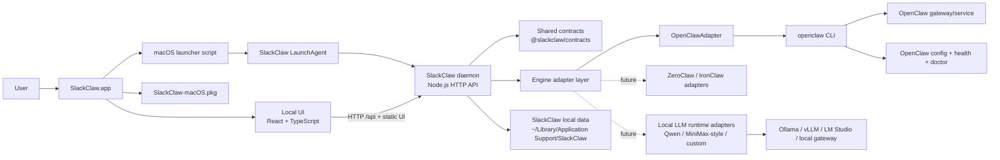

# SlackClaw

SlackClaw is a macOS-first, local-first desktop product that makes OpenClaw usable for non-technical users. This repository currently contains:

- a React + TypeScript desktop UI scaffold
- a local TypeScript daemon with an engine adapter seam
- a first `OpenClawAdapter` implementation with a safe mock fallback
- shared contracts for health, onboarding, task execution, recovery, and updates

## Workspace layout

- `apps/desktop-ui`: React UI for install, onboarding, tasks, health, and recovery
- `apps/daemon`: local API and orchestration layer
- `packages/contracts`: shared domain types and defaults
- `docs/adr`: architecture decisions for v0.1

## Current state

This is an MVP scaffold designed to validate the SlackClaw product shape. It intentionally keeps the engine abstraction narrow and the first-party UX opinionated.

The desktop shell is implemented as a web UI + local daemon boundary so a Tauri wrapper can be added once the Rust toolchain is available in the target environment.

## System structure

### Runtime breakdown

- `SlackClaw.app` is a lightweight launcher that ensures the SlackClaw LaunchAgent is installed, then opens the UI.
- In the packaged app, the daemon is intended to run under a per-user macOS `LaunchAgent` instead of a one-off background shell process.
- The daemon serves both the `/api` endpoints and the built frontend assets when packaged.
- The engine seam lives behind `EngineAdapter`, so SlackClaw product logic does not talk to OpenClaw directly.
- `OpenClawAdapter` checks for an existing pinned OpenClaw install, reuses it when compatible, and only installs when missing or incompatible.
- The adapter seam is intentionally future-facing: it should later support local-LLM runtimes and model families such as Qwen, MiniMax-exposed local runtimes, Llama, Mistral, and other OpenAI-compatible local gateways.
- User state, diagnostics, and SlackClaw metadata live in `~/Library/Application Support/SlackClaw` when packaged.

### Packaging breakdown

- `SlackClaw-macOS.pkg` installs `SlackClaw.app` into `/Applications`.
- The app bundle contains the built UI, daemon, LaunchAgent helper scripts, bootstrap script, shared contracts, and a bundled Node runtime.
- OpenClaw itself remains an external runtime managed by SlackClaw's bootstrap/install flow.

## Languages

The first-party UI currently supports:

- English
- Chinese
- Japanese
- Korean
- Spanish

Language selection is handled in the frontend and stored locally in the browser.

## Future adapter direction

SlackClaw should remain able to support more than OpenClaw.

- Keep the current `EngineAdapter` boundary as the only place where engine-specific logic is allowed.
- Future adapters may target local-LLM runtimes, including model families such as Qwen and other self-hosted stacks exposed through Ollama, vLLM, LM Studio, or compatible local gateways.
- MiniMax-style support should be added through an adapter or local gateway compatibility layer, not by hard-coding provider assumptions into the product UI.
- The product layer should continue to care about install, lifecycle, health, tasks, updates, and recovery, not about model-specific wire formats.

## Quick start

1. Install dependencies with `npm install`
2. Ensure the pinned OpenClaw CLI is present with `npm run bootstrap:openclaw`
3. Run the daemon with `npm run dev:daemon`
4. Run the UI with `npm run dev:ui`

The daemon defaults to `http://127.0.0.1:4545`.

## macOS installer

Build a distributable macOS app bundle and installer package with:

`npm run build:mac-installer`

This produces:

- `dist/macos/SlackClaw.app`
- `dist/macos/SlackClaw-macOS.pkg`

The packaged app bundles the built UI, the daemon, and a Node runtime. On launch it starts the local SlackClaw daemon, serves the built UI on `http://127.0.0.1:4545/`, and opens the app in the default browser.

The packaged app also includes LaunchAgent helper scripts so SlackClaw can run as a login-time background service on macOS.
