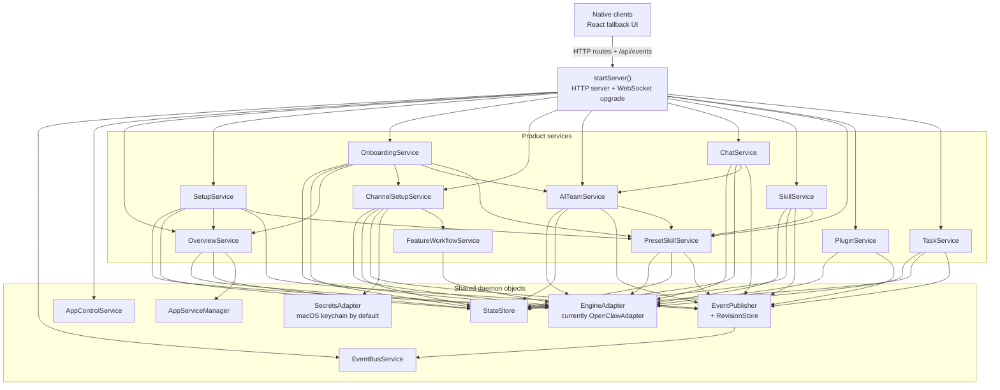
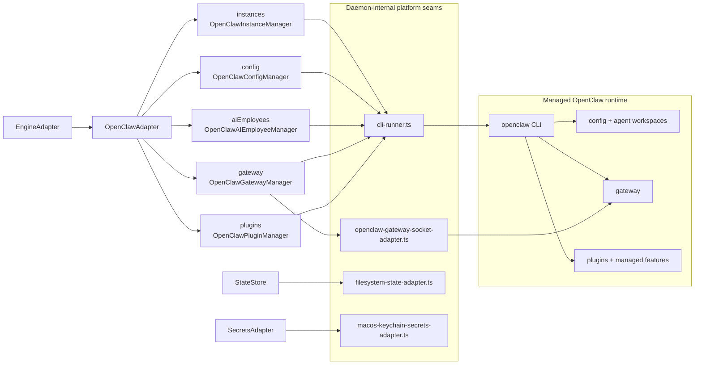

# ChillClaw daemon backend map

This note shows the main backend objects wired in `apps/daemon/src/server.ts` and the engine-manager split defined in `apps/daemon/src/engine/adapter.ts`.

For the current HTTP route inventory, see `docs/reference/daemon-routes.md`.

## Daemon object graph

## Engine manager split

## Reading guide

- `StateStore` is ChillClaw-owned product state for onboarding, AI team data, stored channel entries, chat thread metadata, preset-skill sync state, and recent task history.
- `EventBusService` plus `EventPublisher` is the daemon-owned push path for retained snapshots, deploy progress, task progress, gateway state, and chat stream events.
- Product services stay engine-agnostic. They coordinate user-facing behavior and reach OpenClaw only through the `EngineAdapter` seam.
- OpenClaw-specific behavior is confined to the `OpenClaw*Manager` classes and the platform adapters in `apps/daemon/src/platform`.
