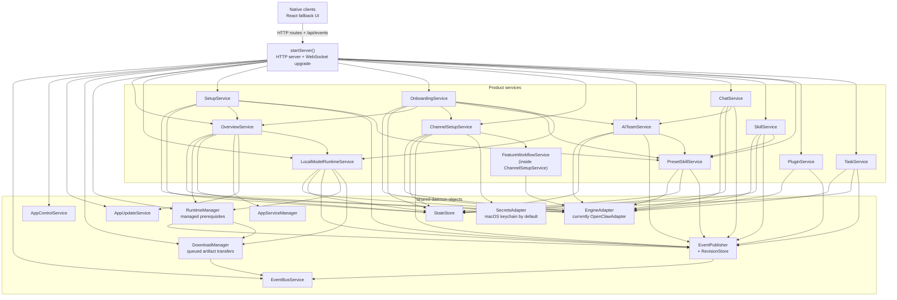
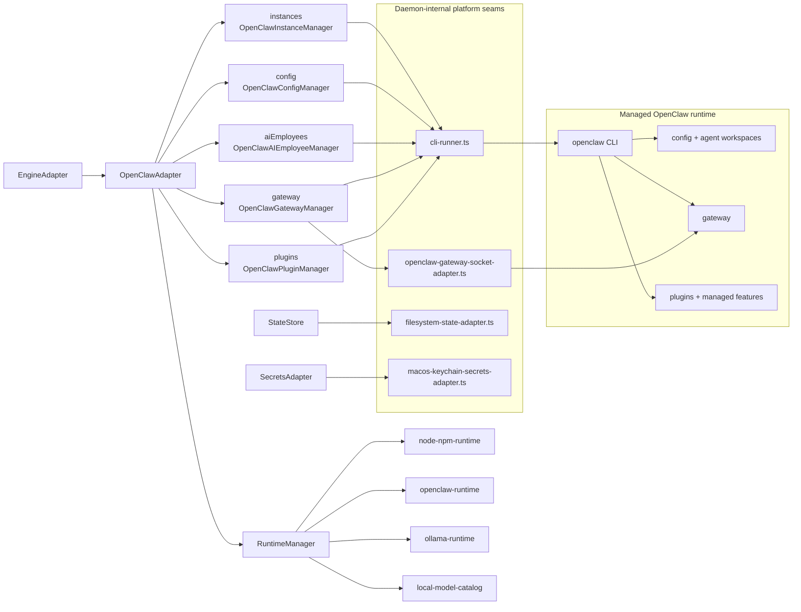

# ChillClaw daemon backend map

This note shows the main backend objects wired in `apps/daemon/src/server.ts` and the engine-manager split defined in `apps/daemon/src/engine/adapter.ts`.

For the current HTTP route inventory, see `docs/reference/daemon-routes.md`.

## Daemon object graph

## Engine manager split

## Reading guide

- `StateStore` is ChillClaw-owned product state for onboarding, AI team data, stored channel entries, chat thread metadata, preset-skill sync state, and recent task history.
- `EventBusService` plus `EventPublisher` is the daemon-owned push path for retained snapshots, deploy progress, task progress, gateway state, and chat stream events.
- `DownloadManager` is the daemon-owned transfer subsystem for runtime artifacts, file artifacts, Ollama model pulls, persistent queue state, temp/cache storage, retained download snapshots, and live job events. Callers own intent; DownloadManager owns bytes, validation, dedupe, pause/resume, cancel, and recovery.
- `RuntimeManager` owns generic prerequisite lifecycle for Node/npm, managed OpenClaw, Ollama, and local model catalog metadata. It is manifest-driven and update-aware, but OpenClaw-specific product behavior still stays inside `OpenClawAdapter`.
- `AppUpdateService` owns packaged app release checks. It feeds overview/settings state but does not manage prerequisite runtimes.
- `LocalModelRuntimeService` owns managed local-model setup state and the handoff from Ollama readiness to OpenClaw model entries; Ollama model pull transfer state is represented as DownloadManager jobs while existing local-runtime progress snapshots remain for current clients.
- `FeatureWorkflowService` is a helper used by `ChannelSetupService` for feature prerequisites such as OpenClaw plugins or external installers; it is not a separately wired server-context singleton.
- Product services stay engine-agnostic. They coordinate user-facing behavior and reach OpenClaw only through the `EngineAdapter` seam.
- OpenClaw-specific behavior is confined to the `OpenClaw*Manager` classes and the platform adapters in `apps/daemon/src/platform`.
