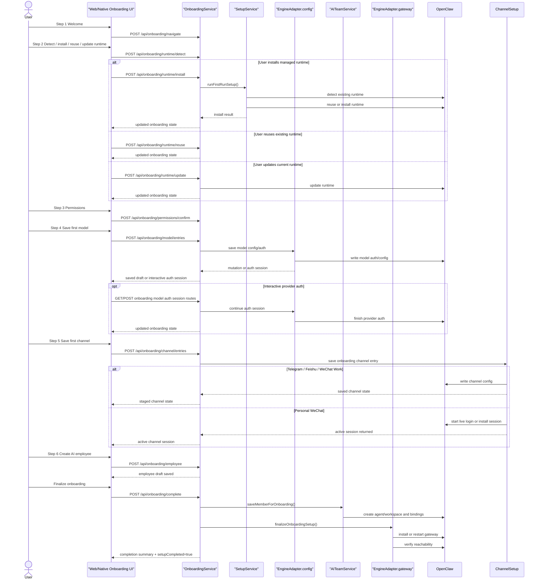
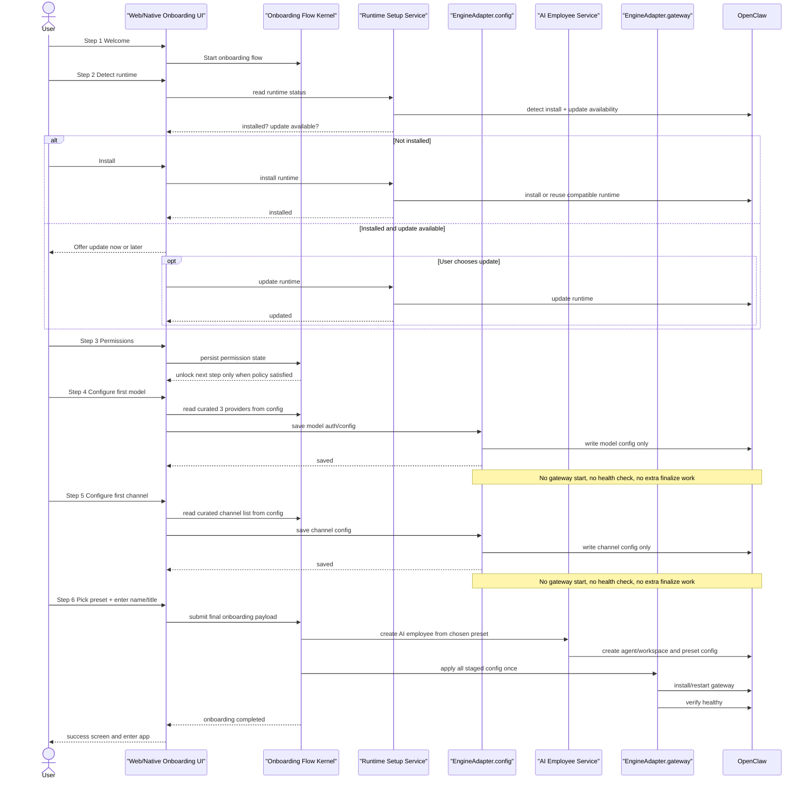

# Onboarding Design and Flow Reference

ChillClaw onboarding should feel like a centered macOS setup experience, not a generic full-width web app.

## Layout

- Main content width: `clamp(windowWidth × 0.70, 672, 1120)`
- Safe range: `64%–70%` of the window width
- Ideal content aspect ratio: `1.60–1.62 : 1`
- Step-1 welcome card height: `clamp(contentWidth ÷ 1.74, 520, 616)` so common 1280-class windows stay flatter and better centered
- Header/logo text zone: `min(768, contentWidth × 0.73)`
- Side gutters on wide windows should naturally land around `15%–16%`
- Use an 8-point spacing grid

Reference desktop composition:

- Main panel: `1056 × 656`
- Side gutters: `240px`
- Header/logo text zone: `768px` max

## Native window sizing

- Default onboarding window size: `1280 × 860`
- Minimum size: `960 × 720`
- Keep the window resizable
- Do not force full-screen on first launch
- As the window grows, keep content centered and capped by the layout formula above

## Typography

- Use the system font in code
- For mockups and design files, the intended family is SF Pro
- Let macOS choose its normal CJK fallback fonts for Chinese, Japanese, and Korean

Preferred sizes:

- Hero title: `34 / 40`, semibold
- Intro/subtitle: `16 / 24`, regular
- Feature card title: `20 / 26`, semibold
- Feature card body: `14 / 20`, regular
- Primary button label: `15 / 20`, semibold
- Meta/progress text: `12 / 16`, medium

## Spacing and shape

- Outer panel padding: `32`
- Inner feature card padding: `24`
- Gap between feature cards: `16–20`
- Gap between title and subtitle: `8–12`
- Gap between sections: `24–32`
- Outer radius: `24`
- Feature card radius: `16`
- Icon tile radius: `12`
- Primary CTA height: `48–52`

## Product rules

- The onboarding language selector should stay available across the whole flow, not only on the welcome step
- Each client should reuse its existing shared language-selector component rather than adding onboarding-only picker logic unless the platform requires a native equivalent
- These rules are the baseline for welcome/setup screens first, then should guide the later onboarding steps as they are refined

## Current implementation snapshot

The current implementation now follows the same six primary steps in both web and native clients, then shows a completion summary after finalization. It is much closer to the target contract than the earlier seven-step version, but a few gaps still remain.

Several parts of the target contract are already implemented: curated onboarding model/channel metadata, curated employee preset presentation, and managed preset-skill ownership all come from daemon-owned config so web and native no longer carry separate onboarding catalogs.

## Target onboarding contract

This is the correct flow to optimize for in new design and engineering work. The daemon should own the step contract, completion gates, curated metadata, and final apply semantics.

## Step rules

1. `Welcome` should only start or resume the guided flow.
2. `Detect Runtime` should decide whether ChillClaw installs, reuses, or updates the managed OpenClaw runtime.
3. `Permissions` should be a real gate owned by the daemon, not just a client-side informational step.
4. `Configure First Model` should show only the three curated onboarding providers from daemon-owned config and should only write model configuration.
5. `Configure First Channel` should show only the curated onboarding channels from daemon-owned config and should only write channel configuration.
6. `Create AI Employee` should collect the preset plus user-facing identity fields, then run one finalization pass that creates the first AI employee and applies staged runtime changes once.

## Flow invariants

- Keep the `UI -> daemon -> EngineAdapter -> OpenClaw` boundary intact for every onboarding step.
- Keep curated model and channel metadata daemon-owned so web and native clients render the same choices.
- Keep curated onboarding employee preset presentation daemon-owned too, including avatar preset ids, starter skill labels, and tool labels.
- Keep staged config distinct from live applied state in both backend contracts and UI copy.
- Do not start the gateway, run health checks, or trigger extra finalization work during steps 4 and 5.
- Do not create the first real AI employee before the final step is submitted.

## Known gaps between current and target flow

- The daemon now enforces basic step order, but permissions are still an acknowledgement gate rather than a verified OS-permission state.
- Personal WeChat onboarding currently starts a live login/install session instead of staying config-only.
- The completion API still accepts destination shortcuts, so transport-level completion and post-completion navigation are not perfectly separated.
