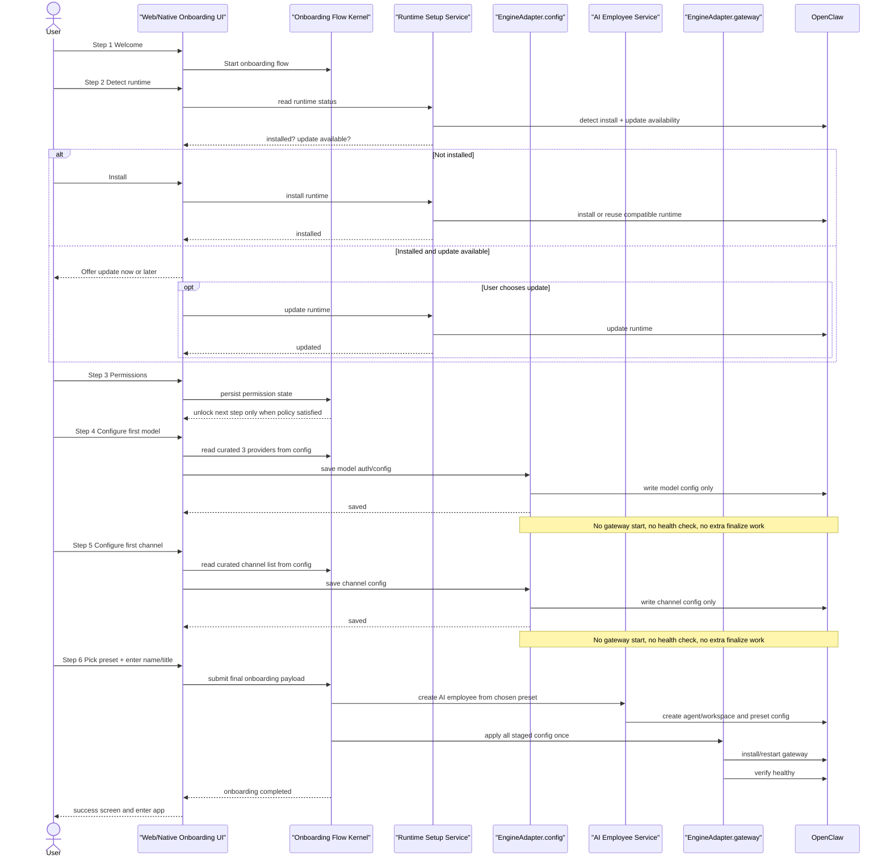

# Onboarding Design and Flow Reference

ChillClaw onboarding should feel like a centered macOS setup experience, not a generic full-width web app.

## Layout

- Main content width: `clamp(windowWidth × 0.70, 672, 1120)`
- Safe range: `64%–70%` of the window width
- Ideal content aspect ratio: `1.60–1.62 : 1`
- Step-1 welcome card height: `clamp(contentWidth ÷ 1.74, 520, 616)` so common 1280-class windows stay flatter and better centered
- Header/logo text zone: `min(768, contentWidth × 0.73)`
- Side gutters on wide windows should naturally land around `15%–16%`
- Use an 8-point spacing grid

Reference desktop composition:

- Main panel: `1056 × 656`
- Side gutters: `240px`
- Header/logo text zone: `768px` max

## Native window sizing

- Default onboarding window size: `1280 × 860`
- Minimum size: `960 × 720`
- Keep the window resizable
- Do not force full-screen on first launch
- As the window grows, keep content centered and capped by the layout formula above

## Typography

- Use the system font in code
- For mockups and design files, the intended family is SF Pro
- Let macOS choose its normal CJK fallback fonts for Chinese, Japanese, and Korean

Preferred sizes:

- Hero title: `34 / 40`, semibold
- Intro/subtitle: `16 / 24`, regular
- Feature card title: `20 / 26`, semibold
- Feature card body: `14 / 20`, regular
- Primary button label: `15 / 20`, semibold
- Meta/progress text: `12 / 16`, medium

## Spacing and shape

- Outer panel padding: `32`
- Inner feature card padding: `24`
- Gap between feature cards: `16–20`
- Gap between title and subtitle: `8–12`
- Gap between sections: `24–32`
- Outer radius: `24`
- Feature card radius: `16`
- Icon tile radius: `12`
- Primary CTA height: `48–52`

## Product rules

- The onboarding language selector should stay available across the whole flow, not only on the welcome step
- Each client should reuse its existing shared language-selector component rather than adding onboarding-only picker logic unless the platform requires a native equivalent
- These rules are the baseline for welcome/setup screens first, then should guide the later onboarding steps as they are refined

## Current implementation snapshot

The current implementation follows the same guided setup shape in both web and native clients, then shows a completion summary after finalization. The visible web step order is currently `welcome -> install -> model -> channel -> employee`; the shared daemon contract still includes `permissions`, and the web client normalizes that state into the model step.

Several parts of the target contract are already implemented: curated onboarding model/channel metadata, curated employee preset presentation, and managed preset-skill ownership all come from daemon-owned config so web and native no longer carry separate onboarding catalogs.

For the exact final-step call chain and simplification review, see `docs/reference/onboarding-finalization-flow.md`.

## Step 2 Runtime Setup Call Path

Step 2 is the Install OpenClaw step. The browser route stays `/onboarding`; the selected step comes from daemon-backed draft state:

```ts
draft.currentStep === "install"
```

Main implementation files:

- `apps/desktop-ui/src/features/onboarding/OnboardingPage.tsx`
- `apps/desktop-ui/src/features/onboarding/helpers.ts`
- `apps/desktop-ui/src/shared/api/client.ts`
- `apps/daemon/src/routes/onboarding.ts`
- `apps/daemon/src/services/onboarding-service.ts`
- `apps/daemon/src/services/setup-service.ts`
- `apps/daemon/src/engine/openclaw-instance-manager.ts`
- `apps/daemon/src/engine/openclaw-runtime-lifecycle-service.ts`
- `apps/daemon/src/engine/openclaw-adapter.ts`

### Step 2 State And Rendering

```text
/onboarding
-> OnboardingPage()
-> currentDraft = onboardingState?.draft
-> currentStep = normalizeOnboardingStep(currentDraft.currentStep)
-> installViewState = resolveOnboardingInstallViewState({
     overview,
     install: currentDraft.install,
     busy: installBusy,
     progress: installProgress
   }, copy)
-> render currentStep === "install" block
```

`resolveOnboardingInstallViewState(...)` maps state to one of four UI modes:

```text
if installBusy:
  kind = "installing"
else if currentDraft.install.installed:
  kind = "complete"
else if overview.engine.installed:
  kind = "found"
else:
  kind = "missing"
```

The UI branches from that mode:

```text
kind "missing"
-> show "Install OpenClaw"
-> click calls handleInstall()

kind "found"
-> show compatible runtime found
-> click "Next" calls handleUseExistingInstall()

kind "complete"
-> show installation complete
-> click "Next" calls handleAdvanceToModel()

kind "installing"
-> show progress bar
```

### Enter Step 2 From Welcome

```text
User clicks "Get My Workspace Ready"
-> handleAdvanceToInstall()
-> setPageError(undefined)
-> goToStep("install")
-> navigateOnboardingStep({ step: "install" })
-> readJson("/onboarding/navigate", POST)
-> fetch(API_BASE + "/onboarding/navigate")
-> POST /api/onboarding/navigate
-> onboardingRoutes handler
-> context.onboardingService.navigateStep(body)
-> OnboardingService.navigateStep()
-> assertOnboardingMutable()
-> readResolvedDraftState()
-> normalizeOnboardingStep(request.step)
-> repairProgressedDraft(...) if moving forward
-> buildSummary(...) or buildDraftSummary(...)
-> canNavigateToStep(...)
-> updateState({ currentStep: "install", ... })
-> store.update(...)
-> return OnboardingStateResponse
-> applyOnboardingState(...)
-> setOnboardingState(next)
```

After entering Step 2, the web client starts runtime detection without blocking the UI:

```text
handleAdvanceToInstall()
-> detectOnboardingRuntime()
-> readJson("/onboarding/runtime/detect", POST)
-> POST /api/onboarding/runtime/detect
-> context.onboardingService.detectRuntime()
-> OnboardingService.detectRuntime()
-> assertOnboardingMutable()
-> detectInstallState(existingDraftInstall)
-> Promise.all([
     adapter.instances.status(),
     adapter.instances.getDeploymentTargets()
   ])
-> choose active or installed deployment target
-> build OnboardingInstallState
-> updateState({ currentStep: "install", install })
-> applyOnboardingState(...)
```

### Missing Runtime Install Path

```text
User clicks "Install OpenClaw"
-> handleInstall()
-> setPageError(undefined)
-> setInstallBusy(true)
-> setInstallProgress({ phase: "detecting", percent: 16, ... })
-> installOnboardingRuntime()
-> readJson("/onboarding/runtime/install", POST, runtimeInstall timeout)
-> POST /api/onboarding/runtime/install
-> context.onboardingService.installRuntime({ forceLocal: true })
-> OnboardingService.installRuntime()
-> assertOnboardingMutable()
-> startOperation("install", "onboarding-runtime-install", ...)
-> new SetupService(...)
-> setupService.runFirstRunSetup({ forceLocal: true })
-> store.update(introCompletedAt)
-> adapter.instances.status()
-> eventPublisher.publishDeployProgress("detecting")
-> eventPublisher.publishDeployProgress("installing" or "reusing")
-> adapter.instances.install(false, { forceLocal: true })
-> OpenClawInstanceManager.install(...)
-> OpenClawRuntimeLifecycleService.install(...)
-> access.ensurePinnedOpenClaw("managed-local")
-> readAdapterState()
-> writeAdapterState({ installedAt, lastInstallMode })
-> invalidateReadCaches()
-> status()
-> return InstallResponse
-> eventPublisher.publishDeployProgress("verifying")
-> eventPublisher.publishDeployCompleted(...)
-> overviewService.getOverview(...)
-> return SetupRunResponse
-> detectInstallStateFromRuntime(...)
-> detectInstallState(...)
-> completeOperation("install", ...)
-> updateState({
     currentStep: install.installed ? "model" : "install",
     install
   })
-> return result with onboarding
-> setOverview(result.overview)
-> applyOnboardingState(result.onboarding)
-> setInstallBusy(false)
```

The actual OpenClaw runtime preparation is intentionally behind the daemon boundary:

```text
SetupService.runFirstRunSetup(...)
-> adapter.instances.install(...)
-> OpenClawInstanceManager.install(...)
-> OpenClawRuntimeLifecycleService.install(...)
-> OpenClawAdapter.ensurePinnedOpenClaw("managed-local")
-> RuntimeManager.prepare("openclaw-runtime") when the managed runtime is missing or stale
-> ensureChillClawGatewayConfigBaseline(...)
```

### Found Runtime Reuse Path

```text
User clicks "Next" while kind === "found"
-> handleUseExistingInstall()
-> stageExistingInstall()
-> reuseOnboardingRuntime()
-> readJson("/onboarding/runtime/reuse", POST)
-> POST /api/onboarding/runtime/reuse
-> context.onboardingService.reuseDetectedRuntime()
-> detectInstallState(...)
-> if !install.installed: throw "OpenClaw is not installed yet."
-> updateState({
     currentStep: "model",
     install: {
       ...install,
       disposition: "reused-existing" or "installed-managed"
     }
   })
-> applyOnboardingState(...)
```

### Complete Runtime Continue Path

```text
User clicks "Next" while kind === "complete"
-> handleAdvanceToModel()
-> goToStep("model")
-> navigateOnboardingStep({ step: "model" })
-> POST /api/onboarding/navigate
-> onboardingService.navigateStep(...)
-> canNavigateToStep(...)
   target "model" requires isCompletedInstall(draft)
-> updateState({ currentStep: "model", ... })
-> applyOnboardingState(...)
```

### Live Progress Path

```text
SetupService publishes deploy.progress / deploy.completed
-> EventPublisher.publishDeployProgress(...)
-> daemon WebSocket event bus
-> subscribeToDaemonEvents(...)
-> OnboardingPage event handler
-> if currentStep === "install":
     deploy.progress -> mergeOnboardingInstallProgress(...)
     runtime.progress/runtime.completed -> onboardingInstallProgressFromRuntimeEvent(...)
-> setInstallProgress(...)
-> resolveOnboardingInstallViewState(...)
-> progress UI updates
```

For Step 2, `onboardingRefreshResourceForEvent(...)` only asks for an overview refresh on `deploy.completed` and `gateway.status`. Onboarding draft updates for install completion normally come back through the install API response, while live progress comes through daemon events.

`POST /api/onboarding/runtime/update` and `POST /api/onboarding/permissions/confirm` still exist in the daemon and client API surface. The current React Step 2 UI does not call the update route, and the visible web flow normalizes `permissions` into the model step.

### Current Implementation Sequence Graph

```mermaid
sequenceDiagram
    autonumber
    actor User
    participant Web as "React onboarding"
    participant Native as "SwiftUI onboarding"
    participant API as "HTTP client"
    participant Routes as "daemon onboarding routes"
    participant Onboarding as "OnboardingService"
    participant Store as "StateStore"
    participant Events as "daemon event bus"
    participant Setup as "SetupService"
    participant Runtime as "RuntimeManager / InstanceManager"
    participant LocalModel as "LocalModelRuntimeService"
    participant Config as "EngineAdapter.config"
    participant ChannelSetup as "ChannelSetupService"
    participant Team as "AITeamService"
    participant Employees as "EngineAdapter.aiEmployees"
    participant Gateway as "EngineAdapter.gateway"
    participant OpenClaw as "OpenClaw runtime"

    Note over Web,Native: Both clients render the same daemon-owned draft, config, summary, operations, preset sync, and capability readiness metadata. Web normalizes the contract step "permissions" into the visible model step.

    par Web boot
        Web->>API: GET /onboarding/state + GET /overview
        API->>Routes: GET /api/onboarding/state
    and Native boot
        Native->>API: GET /onboarding/state
        API->>Routes: GET /api/onboarding/state
    end
    Routes->>Onboarding: getState()
    Onboarding->>Store: readResolvedDraftState()
    Store-->>Onboarding: persisted draft + setup flags
    Onboarding->>Onboarding: repairProgressedDraft()
    opt repair finds live install, model, channel, or deferred WeChat state
        Onboarding->>Runtime: status() + getDeploymentTargets()
        Onboarding->>Config: getModelConfig()
        Onboarding->>ChannelSetup: getConfigOverview()
        Onboarding->>Store: persist repaired draft
    end
    Onboarding->>Onboarding: buildStateResponse()
    opt currentStep == model
        Onboarding->>LocalModel: getOverview()
    end
    Onboarding->>Onboarding: build draft summary
    Onboarding->>Onboarding: read preset skill sync + capability readiness
    Onboarding-->>Routes: OnboardingStateResponse
    Routes-->>API: draft, config, summary, operations
    API-->>Web: hydrate visible step
    API-->>Native: hydrate visible step

    User->>Web: Welcome: Get My Workspace Ready
    User->>Native: Welcome: Begin
    par Web enters install
        Web->>API: POST /onboarding/navigate { step: "install" }
    and Native enters install
        Native->>API: POST /onboarding/navigate { step: "install" }
    end
    API->>Routes: POST /api/onboarding/navigate
    Routes->>Onboarding: navigateStep("install")
    Onboarding->>Store: read + repair + gate navigation
    Onboarding->>Store: update currentStep = install
    Onboarding-->>API: updated onboarding state
    API-->>Web: install step
    API-->>Native: install step

    par Runtime detection after entering install
        Web->>API: POST /onboarding/runtime/detect
    and Native runtime detection
        Native->>API: POST /onboarding/runtime/detect
    end
    API->>Routes: POST /api/onboarding/runtime/detect
    Routes->>Onboarding: detectRuntime()
    Onboarding->>Runtime: status() + getDeploymentTargets()
    Runtime->>OpenClaw: inspect managed/runtime state
    Runtime-->>Onboarding: installed/version/update metadata
    Onboarding->>Store: update install draft
    Onboarding-->>API: install missing/found/complete
    API-->>Web: resolveOnboardingInstallViewState()
    API-->>Native: resolveNativeOnboardingInstallViewState()

    alt runtime missing: install managed runtime
        User->>Web: Install OpenClaw
        User->>Native: Install OpenClaw
        par client calls install
            Web->>API: POST /onboarding/runtime/install { forceLocal: true }
        and native calls install
            Native->>API: POST /onboarding/runtime/install { forceLocal: true }
        end
        API->>Routes: POST /api/onboarding/runtime/install
        Routes->>Onboarding: installRuntime(forceLocal)
        Onboarding->>Store: start install operation
        Onboarding->>Setup: runFirstRunSetup(forceLocal)
        Setup->>Events: deploy.progress detecting
        Events-->>Web: install progress bar update
        Events-->>Native: install progress bar update
        Setup->>Runtime: status()
        Setup->>Events: deploy.progress installing/reusing
        Runtime->>OpenClaw: prepare pinned managed runtime
        Runtime->>OpenClaw: ensure local gateway baseline
        Runtime-->>Setup: InstallResponse
        Setup->>Events: deploy.progress verifying
        Setup->>Events: deploy.completed
        Setup-->>Onboarding: SetupRunResponse + overview
        Onboarding->>Runtime: reconcile install state
        Onboarding->>Store: complete install operation
        Onboarding->>Store: currentStep = model when installed
        Onboarding-->>API: overview + onboarding state
        API-->>Web: show model step
        API-->>Native: show model step
    else compatible runtime found: reuse
        User->>Web: Next
        User->>Native: Next
        par client calls reuse
            Web->>API: POST /onboarding/runtime/reuse
        and native calls reuse
            Native->>API: POST /onboarding/runtime/reuse
        end
        API->>Routes: POST /api/onboarding/runtime/reuse
        Routes->>Onboarding: reuseDetectedRuntime()
        Onboarding->>Runtime: detect install state
        Onboarding->>Store: currentStep = model, disposition = reused-existing
        Onboarding-->>API: updated onboarding state
    else native update available
        User->>Native: Update runtime
        Native->>API: POST /onboarding/runtime/update
        API->>Routes: POST /api/onboarding/runtime/update
        Routes->>Onboarding: updateRuntime()
        Onboarding->>Runtime: update active deployment target
        Runtime->>OpenClaw: update managed/runtime install
        Onboarding->>Runtime: reconcile install state
        Onboarding->>Store: currentStep = model when installed
        Onboarding-->>API: SetupRunResponse + overview + onboarding state
    end

    Note over Web,Native: Step 3 in the visible clients is model setup. The daemon route POST /api/onboarding/permissions/confirm still exists, but the current visible flow does not show a separate permissions screen.

    alt local-first model path
        Web->>API: GET /onboarding/state on model bootstrap
        Native->>API: GET /onboarding/state on model bootstrap
        API->>Routes: GET /api/onboarding/state
        Routes->>Onboarding: getState()
        Onboarding->>LocalModel: getOverview()
        Onboarding-->>API: localRuntime status in onboarding state
        opt idle/degraded local runtime
            Web->>API: POST /models/local-runtime/install or repair
            Native->>API: POST /models/local-runtime/install or repair
            API->>LocalModel: install() or repair()
            LocalModel->>Events: local-runtime.progress
            Events-->>Web: local model setup progress
            Events-->>Native: local model setup progress
            LocalModel->>OpenClaw: install Ollama/model and register saved model
            LocalModel->>Events: local-runtime.completed
            Events-->>Web: refresh onboarding state
            Events-->>Native: refresh onboarding state
            LocalModel-->>API: modelConfig + localRuntime + optional onboarding
            API-->>Web: currentStep may advance to channel
            API-->>Native: currentStep may advance to channel
        end
    else cloud provider path
        User->>Web: Save first model
        User->>Native: Save first model
        par client saves model
            Web->>API: POST /onboarding/model/entries
        and native saves model
            Native->>API: POST /onboarding/model/entries
        end
        API->>Routes: POST /api/onboarding/model/entries
        Routes->>Onboarding: saveModelEntry()
        Onboarding->>Config: createSavedModelEntry() or updateSavedModelEntry()
        Config->>OpenClaw: write model auth/config
        Config-->>Onboarding: mutation result or auth session
        Onboarding->>Config: replaceFallbackModelEntries([])
        Onboarding->>Events: model-config.updated
        Events-->>Web: refresh model config
        Events-->>Native: refresh model config
        Onboarding->>Store: model draft, activeModelAuthSessionId or currentStep = channel
        Onboarding-->>API: ModelConfigActionResponse + onboarding
        opt interactive provider auth
            loop poll or submit provider auth
                Web->>API: GET/POST /onboarding/model/auth/session/:id
                Native->>API: GET/POST /onboarding/model/auth/session/:id
                API->>Routes: model auth session route
                Routes->>Onboarding: getModelAuthSession() or submitModelAuthSessionInput()
                Onboarding->>Config: continue auth session
                Config->>OpenClaw: finish provider auth when ready
                Onboarding->>Store: currentStep = channel on completed session
                Onboarding-->>API: session + modelConfig + onboarding
            end
        end
    end

    User->>Web: Save first channel
    User->>Native: Save first channel
    par client saves channel
        Web->>API: POST or PATCH /onboarding/channel/entries
    and native saves channel
        Native->>API: POST or PATCH /onboarding/channel/entries
    end
    API->>Routes: channel entry route
    Routes->>Onboarding: saveChannelEntry(entryId, request)
    Onboarding->>Store: start channel operation
    Onboarding->>Onboarding: buildSummary() and require saved model
    Onboarding->>ChannelSetup: save onboarding channel entry
    ChannelSetup->>OpenClaw: write or start channel setup
    ChannelSetup-->>Onboarding: channelConfig, message, optional session
    alt staged channel entry
        Onboarding->>Store: complete channel operation
        Onboarding->>Store: currentStep = employee, channelProgress = staged
        Onboarding-->>API: ChannelConfigActionResponse + onboarding
        API-->>Web: render employee step
        API-->>Native: render employee step
    else interactive channel session
        Onboarding->>Store: channel operation awaiting-pairing
        Onboarding->>Store: currentStep = channel, activeChannelSessionId
        Onboarding-->>API: active session + onboarding
        API-->>Web: show QR/log/input session UI
        API-->>Native: show QR/log/input session UI
        loop poll or submit channel session input
            Web->>API: GET/POST /onboarding/channel/session/:id
            Native->>API: GET/POST /onboarding/channel/session/:id
            API->>Routes: channel session route
            Routes->>Onboarding: getChannelSession() or submitChannelSessionInput()
            Onboarding->>ChannelSetup: read/continue session
            ChannelSetup->>OpenClaw: continue login/pairing
            Onboarding->>Store: staged channel and currentStep = employee when completed
            Onboarding-->>API: session + channelConfig + onboarding
        end
    end

    Note over Web,Native: Employee fields autosave while the employee step is open. The primary create action also submits the employee payload to the completion endpoint.
    loop employee draft autosave
        Web->>API: POST /onboarding/employee
        Native->>API: POST /onboarding/employee
        API->>Routes: POST /api/onboarding/employee
        Routes->>Onboarding: saveEmployeeDraft()
        Onboarding->>Store: currentStep = employee, employee draft
        Onboarding-->>API: draft summary response
    end

    User->>Web: Create AI employee
    User->>Native: Create AI employee
    par client completes with employee payload
        Web->>API: POST /onboarding/complete { employee }
    and native completes with employee payload
        Native->>API: POST /onboarding/complete { employee }
    end
    API->>Routes: POST /api/onboarding/complete
    Routes->>Onboarding: complete(request)
    Onboarding->>Store: start completion operation
    Onboarding->>Onboarding: buildFinalizeSummary() + assertReadyForFinalize()
    opt selected model is local Ollama and not ready
        Onboarding->>LocalModel: repair()
        LocalModel->>OpenClaw: repair/register local model
    end
    Onboarding->>Config: canReuseSavedModelEntry() / resolve saved model
    Onboarding->>Store: completion operation creating-employee
    Onboarding->>Team: saveMemberForOnboarding()
    Team->>OpenClaw: create agent/workspace, defer warmup
    Team-->>Onboarding: created member
    Onboarding->>Team: bindMemberChannelForOnboarding()
    Onboarding->>Employees: setPrimaryAIMemberAgent()
    Employees->>OpenClaw: write active primary agent
    Onboarding->>Store: completion operation applying-gateway
    Onboarding->>Gateway: finalizeOnboardingSetup()
    Gateway->>OpenClaw: apply config, install/restart gateway, verify reachability
    Onboarding->>Store: setupCompletedAt, clear onboarding draft, persist warmup task
    Onboarding->>Store: completion operation completed
    Onboarding-->>API: CompleteOnboardingResponse + warmupTaskId
    API-->>Web: completion summary screen
    API-->>Native: completion summary screen

    par background warmup job
        Onboarding->>Team: mark warmup progress "Verifying preset skills"
        Onboarding->>Events: task.progress running
        Events-->>Web: completion warmup message
        Events-->>Native: completion warmup message
        Onboarding->>Onboarding: presetSkillService.setDesiredPresetSkillIds(waitForReconcile)
        Onboarding->>Team: finalizeOnboardingWarmup()
        Onboarding->>Gateway: finalizeOnboardingSetup()
        Gateway->>OpenClaw: verify gateway readiness for first chat
        Onboarding->>Store: warmup completed or failed
        Onboarding->>Events: task.progress completed/failed
    and destination after completion
        User->>Web: Team / Dashboard / Chat
        User->>Native: Team / Dashboard / Chat
        Web->>Web: navigate when completion screen is showing
        Native->>Native: enter destination when warmup allows it
    end

    opt skip shortcut before completion screen
        User->>Web: Skip
        User->>Native: Skip to dashboard
        Web->>API: POST /onboarding/complete { destination }
        Native->>API: POST /onboarding/complete { destination }
        API->>Routes: POST /api/onboarding/complete
        Routes->>Onboarding: complete(destination)
        Onboarding->>Onboarding: buildSummary() only
        Onboarding->>Store: setupCompletedAt and clear onboarding draft
        Onboarding-->>API: completed response
    end
```



## Target onboarding contract

This is the correct flow to optimize for in new design and engineering work. The daemon should own the step contract, completion gates, curated metadata, and final apply semantics.



## Step rules

1. `Welcome` should only start or resume the guided flow.
2. `Detect Runtime` should decide whether ChillClaw installs, reuses, or updates the managed OpenClaw runtime. Managed prerequisite preparation should flow through the daemon Runtime Manager instead of page-local or step-local installers.
3. `Permissions` should be a real gate owned by the daemon, not just a client-side informational step.
4. `Configure First Model` should show only the three curated onboarding providers from daemon-owned config and should only write model configuration.
5. `Configure First Channel` should show only the curated onboarding channels from daemon-owned config and should only write channel configuration.
6. `Create AI Employee` should collect the preset plus user-facing identity fields, then run one finalization pass that creates the first AI employee and applies staged runtime changes once.

## Flow invariants

- Keep the `UI -> daemon -> RuntimeManager / EngineAdapter -> OpenClaw` boundary intact for every onboarding step. The Runtime Manager supplies prerequisites; the adapter still owns OpenClaw behavior.
- Keep curated model and channel metadata daemon-owned so web and native clients render the same choices.
- Keep curated onboarding employee preset presentation daemon-owned too, including avatar preset ids, starter skill labels, and tool labels.
- Keep staged config distinct from live applied state in both backend contracts and UI copy.
- Do not start the gateway, run health checks, or trigger extra finalization work during steps 4 and 5.
- Do not create the first real AI employee before the final step is submitted.

## Known gaps between current and target flow

- The daemon now enforces basic step order, but permissions are still an acknowledgement gate rather than a verified OS-permission state.
- Personal WeChat onboarding currently starts a live login/install session instead of staying config-only.
- The completion API still accepts destination shortcuts, so transport-level completion and post-completion navigation are not perfectly separated.
