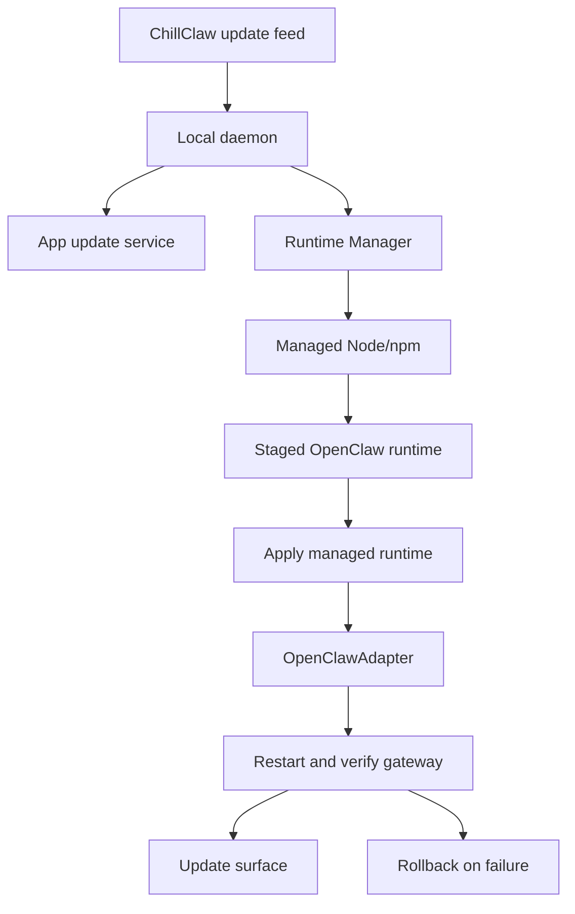

# Managed Runtime Updates Design

**Date:** 2026-04-17

## Goal

Let users update OpenClaw through ChillClaw while preserving ChillClaw's local-first runtime boundary, pinned packaged baseline, compatibility policy, verification, and rollback behavior.

## Scope

- Add OpenClaw runtime updates to the ChillClaw update experience
- Keep `runtime-manifest.lock.json` as the packaged fallback baseline
- Use a ChillClaw-curated update feed for approved runtime versions
- Update only ChillClaw-managed runtime paths, never system OpenClaw installs
- Stage, verify, apply, restart, and roll back OpenClaw through Runtime Manager
- Surface app and runtime updates together in user-facing update surfaces

## Non-Goals

- Do not remove the packaged runtime lock
- Do not install `openclaw@latest` directly for normal users
- Do not mutate global npm packages or a user-managed OpenClaw on `PATH`
- Do not let frontend code call OpenClaw directly
- Do not require every OpenClaw runtime update to ship as a full ChillClaw app update

## Product Model

ChillClaw has one user-facing update system with multiple managed update tracks:

- ChillClaw app update: desktop app, daemon, UI, contracts, scripts, and packaged runtime baseline
- OpenClaw runtime update: managed engine runtime under ChillClaw's data directory
- Other managed runtime updates: Node/npm, Ollama CLI, and local model catalog metadata

Users should not need to understand those tracks unless something fails. The update surface should say what will change, that ChillClaw manages the runtime locally, and that ChillClaw will verify before finishing.

## Runtime Model

### Bundled Baseline

The bundled baseline remains `runtime-manifest.lock.json`.

It defines the version that ships with the app and the version ChillClaw can always restore when an update fails or no approved update feed is available.

### Approved Runtime Update

Runtime updates come from a ChillClaw-controlled update feed. The feed must resolve to concrete versions and concrete artifacts before installation.

For normal users, OpenClaw runtime updates should be approved versions, not upstream `latest`. A future preview channel may use newer approved versions, but it should still resolve to a concrete version before staging.

Example manifest shape:

```json
{
  "resources": [
    {
      "id": "openclaw-runtime",
      "kind": "engine",
      "label": "OpenClaw runtime",
      "version": "2026.4.18",
      "platforms": [{ "os": "darwin", "arch": "*" }],
      "sourcePolicy": ["download"],
      "updatePolicy": "stage-silently-apply-safely",
      "installDir": "openclaw-runtime",
      "activePath": "openclaw-runtime/node_modules/.bin/openclaw",
      "artifacts": [
        {
          "source": "download",
          "format": "npm-package",
          "package": "openclaw",
          "version": "2026.4.18"
        }
      ],
      "dependencies": ["node-npm-runtime"]
    }
  ]
}
```

The exact field names can change during implementation, but the product invariant should not: approved runtime updates identify a concrete OpenClaw package version.

## Update Flow

1. ChillClaw checks the app update feed and Runtime Manager update feed.
2. The update surface combines available app and runtime updates into one user-facing summary.
3. If a newer ChillClaw app is required before a runtime update, the app update is recommended first.
4. If the current ChillClaw app supports the newer OpenClaw runtime, the runtime update can be offered independently.
5. Runtime Manager stages the approved OpenClaw package into a temporary or staging directory using ChillClaw-managed Node/npm.
6. Runtime Manager verifies:
   - managed Node/npm is available
   - OpenClaw binary exists at the staged runtime path
   - `openclaw --version` matches the approved concrete version
   - artifact digest or package integrity checks pass when metadata is available
7. Runtime Manager applies the staged runtime inside ChillClaw's managed data directory.
8. `OpenClawAdapter` normalizes ChillClaw's local gateway baseline.
9. ChillClaw restarts the OpenClaw gateway and waits for health checks.
10. If verification or restart fails, ChillClaw restores the previous managed runtime or bundled baseline.

## App Update Integration

The app should expose one update concept:

- `ChillClaw update available`
- `OpenClaw runtime update available`
- `Managed runtime updates available`

Internally, app updates and runtime updates remain separate lifecycle actions.

Rules:

- A full ChillClaw app update may include a newer bundled runtime baseline.
- Runtime-only updates may be offered between app releases when the current app version is compatible.
- The runtime update feed should support compatibility gates such as minimum and maximum ChillClaw app versions.
- If compatibility is uncertain, the app should recommend updating ChillClaw first instead of offering the runtime update.

## User Experience

The update surface should make the safe path obvious:

- Show current managed OpenClaw version
- Show approved update version when available
- Explain that ChillClaw updates only its managed local runtime
- Explain that ChillClaw will restart and verify the assistant engine
- Prefer one primary action

Example copy:

> OpenClaw runtime update available
> ChillClaw will update its managed local runtime, restart the assistant engine, and verify everything before finishing.

Failure copy:

> ChillClaw could not verify the updated OpenClaw runtime, so it restored the previous working version.

## Architecture

Runtime Manager remains the generic lifecycle owner:

- update feed loading
- dependency ordering
- staging
- artifact verification
- apply
- rollback
- runtime overview state

`OpenClawAdapter` remains the OpenClaw-specific product owner:

- gateway config baseline
- loopback bind and token-auth normalization
- gateway restart
- gateway reachability
- engine health classification
- channel, model, skill, task, and AI employee behavior

Clients render daemon-owned update metadata. They do not infer OpenClaw update rules locally.

## Data Flow



## Compatibility Policy

Every approved OpenClaw runtime update should include enough metadata for ChillClaw to decide whether the current app can apply it.

Suggested fields:

- `minimumChillClawVersion`
- `maximumChillClawVersion` or supported app version range
- `channel`: stable or preview
- `releaseNotesUrl`
- `requiresAppUpdate`: optional explicit gate

If a runtime update requires a newer app version, the user-facing update surface should present the ChillClaw app update first.

## Testing

Add tests for:

- Runtime Manager reports an approved OpenClaw runtime update from the feed
- Runtime Manager stages an approved npm-package OpenClaw artifact without changing the active runtime
- Runtime Manager applies the staged OpenClaw runtime through managed Node/npm
- failed apply restores the previous managed runtime state
- deployment target update uses Runtime Manager instead of `openclaw update`
- product overview and deployment targets distinguish installed, desired, latest approved, staged, and active runtime versions
- update surface renders app-only, runtime-only, and combined update states

## Verification

Expected implementation verification:

- targeted Runtime Manager tests
- targeted OpenClaw lifecycle tests
- targeted update UI tests
- `npm run build`
- `npm test`
- packaged macOS smoke path when changing runtime artifacts, signing, or LaunchAgent update environment

