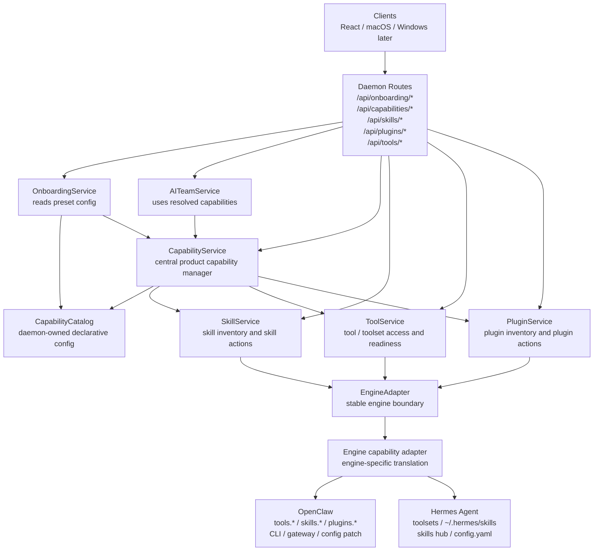
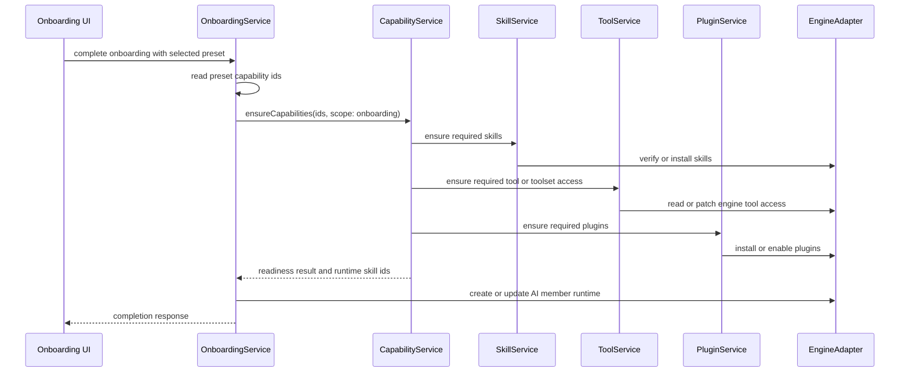
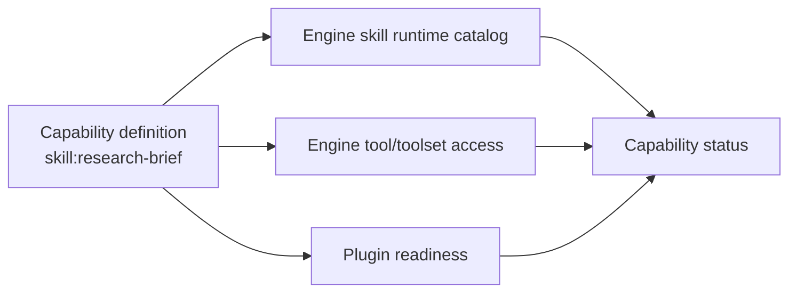

# Capability Management Design

## Goal

Create one daemon-owned product layer that controls whether ChillClaw skills, tools, plugins, and onboarding presets are usable.

The design should make skills easier for ordinary users to manage without exposing raw engine complexity, while still mapping cleanly to the tool, skill, and plugin models used by OpenClaw and Hermes Agent:

- tools are what the agent calls
- skills teach the agent when and how to use tools
- plugins can package tools, skills, providers, channels, and other runtime capabilities

Related cleanup TODO:

- `docs/superpowers/specs/2026-04-19-capability-management-refactor-todo.md`

## Problem

ChillClaw has been moving skill, plugin, tool, and preset ownership into capability management. Before this refactor, ownership was split across several services:

- `SkillService` builds the installed skill catalog and handles custom, bundled, and marketplace skill actions.
- preset-skill reconciliation lived in a separate service.
- `PluginService` manages the curated plugin surface.
- feature prerequisite preparation lived in a separate workflow service.
- Onboarding and AI team flows each know part of the skill readiness story.

This split works for the current small catalog, but it is the wrong long-term control point.

The main issue is that "preset skill sync" is not a domain. A preset is just product configuration that declares desired capabilities. The capability layer should decide which skills, tools, plugins, config entries, or credentials must be ready.

The current shape also misses tool management as a first-class concern. OpenClaw exposes tool policy through config fields such as `tools.profile`, `tools.allow`, `tools.deny`, `tools.byProvider`, and per-agent tool profile overrides. A ChillClaw skill can be installed but still unusable if the required tools are unavailable, denied, hidden by profile, or supplied by a missing plugin.

## Engine Alignment

The capability model must work for OpenClaw now and Hermes Agent later. It should describe product intent in engine-neutral terms, then let each engine adapter translate that intent into the runtime's own tools, skills, plugins, config, and install flows.

### OpenClaw

OpenClaw's documented layers are:

1. Tools are typed functions the agent can call.
2. Skills are `SKILL.md` folders that teach the agent when and how to use tools.
3. Plugins package capabilities and can register additional tools and skills.

OpenClaw tool configuration includes:

- `tools.allow`
- `tools.deny`
- `tools.profile`
- `tools.byProvider`
- tool groups such as `group:runtime`, `group:fs`, `group:web`, `group:ui`, `group:automation`, `group:messaging`, `group:media`, and `group:openclaw`
- per-agent tool profile overrides through `agents.list[].tools.profile`

OpenClaw skill configuration includes:

- skill roots and precedence
- `skills.entries.<skillKey>.enabled`
- `skills.entries.<skillKey>.env`
- `skills.entries.<skillKey>.apiKey`
- `skills.allowBundled`
- `agents.defaults.skills`
- `agents.list[].skills`

OpenClaw plugin configuration includes:

- `plugins.enabled`
- `plugins.allow`
- `plugins.deny`
- `plugins.load.paths`
- `plugins.entries.<id>`
- plugin slots

For partial config mutations, ChillClaw should prefer an adapter path that maps to OpenClaw's `config.schema.lookup` plus `config.patch` model when available. Direct config-file edits can remain adapter-internal fallback behavior, but product services should not own that detail.

### Hermes Agent

Hermes Agent uses similar concepts with different runtime names and mechanics:

- tools are functions grouped into toolsets
- common toolsets include `web`, `terminal`, `file`, `browser`, `vision`, `image_gen`, `skills`, `tts`, `todo`, `memory`, `session_search`, `cronjob`, `code_execution`, `delegation`, `clarify`, `homeassistant`, `rl`, and dynamic `mcp-<server>` toolsets
- platform presets such as `hermes-cli` and `hermes-telegram` select toolsets per surface
- skills are AgentSkills-compatible `SKILL.md` folders
- the primary skills directory is `~/.hermes/skills/`
- external skill directories are read-only scan roots
- skills can declare `requires_toolsets`, `fallback_for_toolsets`, `requires_tools`, and `fallback_for_tools`
- skills can declare required environment variables and non-secret config settings
- skills can be installed, updated, audited, reset, and uninstalled from multiple hub sources
- the agent can create, patch, edit, and delete local skills through `skill_manage`

This means ChillClaw should not model tools only as OpenClaw `tools.allow` and `tools.deny`. It should model engine-neutral tool access, with OpenClaw using tool policy and Hermes using toolsets, platform presets, and skill metadata gates.

## Design Principles

- Keep `UI -> daemon service -> EngineAdapter -> engine` intact.
- Put product intent in daemon services, not in an engine adapter.
- Keep engine-specific commands, config patching, gateway calls, and filesystem behavior inside the adapter layer.
- Treat onboarding presets as declarative configuration, not as a service with its own runtime lifecycle.
- Treat tools and toolsets as first-class managed capability requirements, not as incidental chat events.
- Keep existing skill and plugin routes stable while adding the central capability layer.
- Prefer capability readiness and repair over raw diagnosis in user-facing UX.

## Proposed Architecture



`CapabilityService`, `SkillService`, `ToolService`, and `PluginService` are product-layer services. They should not care whether the active engine is OpenClaw, Hermes, or a future local backend.

`EngineAdapter` exposes a stable capability-oriented contract. The OpenClaw adapter maps it to OpenClaw config and CLI behavior. A future Hermes adapter maps the same contract to Hermes toolsets, `config.yaml`, `~/.hermes/skills`, and Hermes skill hub commands.

## Service Responsibilities

### CapabilityService

`CapabilityService` is the central product manager. It answers whether a user-facing capability can work.

Responsibilities:

- read capability definitions from daemon-owned catalog config
- combine skill, tool, and plugin readiness into one product status
- prepare capabilities for onboarding, AI members, channels, and future feature flows
- resolve selected product capabilities into engine runtime skill ids
- recommend one safe next action when something is missing
- publish a retained capability status event when capability readiness changes

Example methods:

```ts
getCapabilityOverview(): Promise<CapabilityOverview>
getCapabilityDetail(capabilityId: string): Promise<CapabilityDetail>
ensureCapabilities(request: EnsureCapabilitiesRequest): Promise<EnsureCapabilitiesResponse>
resolveRuntimeSkillIds(capabilityIds: string[]): Promise<string[]>
repairCapability(capabilityId: string): Promise<CapabilityActionResponse>
```

### SkillService

`SkillService` remains the skill inventory and skill action surface.

Responsibilities:

- build installed skill catalog
- install bundled, custom, and marketplace skills
- update or remove skills when safe
- verify whether a runtime skill is eligible
- map skill definitions to engine runtime skill ids
- expose skill details for Skills UI

`SkillService` should no longer know about onboarding-specific preset sync. It can expose reusable operations such as `ensureManagedSkill` and `resolveRuntimeSkillId`.

### ToolService

`ToolService` is new. It owns tool and toolset access readiness.

Responsibilities:

- read effective global tool access
- read effective per-agent or per-platform tool access
- understand engine-neutral tool categories such as web, files, terminal, browser, memory, messaging, media, automation, delegation, and MCP tools
- understand OpenClaw tool groups and Hermes toolsets as engine-specific implementations of those categories
- identify whether required tools, tool groups, or toolsets are allowed, denied, unavailable, or hidden by platform/preset
- patch tool access policy or toolset config through the adapter
- report plugin-provided tools when the adapter can inspect them
- explain policy conflicts in product language

Example methods:

```ts
getToolOverview(): Promise<ToolOverview>
getEffectiveToolAccess(scope?: ToolAccessScope): Promise<ToolAccessOverview>
ensureToolRequirements(request: EnsureToolRequirementsRequest): Promise<ToolAccessActionResponse>
patchToolAccess(request: PatchToolAccessRequest): Promise<ToolAccessActionResponse>
```

Tool readiness should distinguish:

- built-in tool is known and allowed
- built-in tool is known but denied
- tool group is allowed through profile
- toolset is enabled through a Hermes platform preset
- tool is expected from a plugin but plugin is missing
- provider-specific policy blocks the tool
- skill metadata hides the skill because a required tool or toolset is missing
- fallback skill appears because a preferred tool or toolset is unavailable
- policy state cannot be read

### PluginService

`PluginService` remains the managed plugin action surface.

Responsibilities:

- show curated managed plugins
- install, update, enable, and remove managed plugins
- block removal while dependent capabilities are active
- expose plugin-provided capabilities when known
- keep non-managed plugin inventory hidden from ordinary user flows unless a future advanced surface needs it

### EngineAdapter Capability Contract

The existing `EngineAdapter` should grow a capability-oriented contract that stays engine-neutral.

Example adapter-facing methods:

```ts
listRuntimeSkills(): Promise<RuntimeSkillCatalog>
ensureRuntimeSkill(request: RuntimeSkillEnsureRequest): Promise<RuntimeSkillEnsureResult>
listRuntimeTools(scope?: ToolAccessScope): Promise<RuntimeToolCatalog>
getRuntimeToolAccess(scope?: ToolAccessScope): Promise<RuntimeToolAccess>
patchRuntimeToolAccess(request: RuntimeToolAccessPatch): Promise<RuntimeToolAccessResult>
listRuntimePlugins(): Promise<RuntimePluginCatalog>
ensureRuntimePlugin(request: RuntimePluginEnsureRequest): Promise<RuntimePluginEnsureResult>
```

OpenClaw implementation notes:

- skills map to `openclaw skills list/check/info`, ClawHub, bundled `SKILL.md`, and `skills.entries.*`
- tools map to `tools.profile`, `tools.allow`, `tools.deny`, `tools.byProvider`, and per-agent tool overrides
- plugins map to `openclaw plugins *` plus `plugins.entries.*`

Hermes implementation notes:

- skills map to `~/.hermes/skills/`, external skill dirs, `skill_manage`, and `hermes skills *`
- tools map to toolsets, platform presets, MCP toolsets, terminal backend config, and tool gateway availability
- plugins map to Hermes plugins and provider integrations when ChillClaw starts managing them

### OnboardingService

`OnboardingService` should stop owning preset skill sync.

Responsibilities:

- read onboarding preset config
- store onboarding draft selections
- on completion, ask `CapabilityService` to ensure the selected preset's required capabilities
- use resolved runtime skill ids when creating the AI member

Onboarding presets should be declarative:

```ts
{
  id: "research-analyst",
  label: "Research Analyst",
  requiredCapabilityIds: [
    "skill:research-brief",
    "skill:status-writer",
    "toolset:web",
    "toolset:file"
  ],
  presentation: {
    starterSkillLabels: ["Research Brief", "Status Writer"],
    toolLabels: ["Web research", "Files"]
  }
}
```

## Capability Catalog

The capability catalog is daemon-owned config. It is not engine runtime state.
It may contain engine-specific mappings, but its primary ids and user-facing meaning should stay engine-neutral.

Initial catalog kinds:

- `skill`
- `tool`
- `tool-group`
- `toolset`
- `plugin`
- `feature`
- `preset`

Example definitions:

```ts
{
  id: "skill:research-brief",
  kind: "skill",
  label: "Research Brief",
  runtimeSkill: {
    openclaw: { slug: "research-brief" },
    hermes: { name: "research-brief" }
  },
  installSource: "bundled",
  bundledAssetPath: "apps/daemon/preset-skills/research-brief/SKILL.md",
  requires: [
    { kind: "toolset", id: "web" },
    { kind: "toolset", id: "file" }
  ]
}
```

```ts
{
  id: "skill:image-lab",
  kind: "skill",
  label: "Image Lab",
  runtimeSkill: {
    openclaw: { slug: "image-lab" },
    hermes: { name: "image-lab" }
  },
  installSource: {
    openclaw: "clawhub",
    hermes: "skills-hub"
  },
  requires: [
    { kind: "tool", id: "image_generate" },
    { kind: "toolset", id: "image_gen" },
    { kind: "provider-auth", id: "openai" }
  ]
}
```

```ts
{
  id: "plugin:wecom",
  kind: "plugin",
  label: "WeCom Plugin",
  runtimePlugin: {
    openclaw: { id: "wecom" },
    hermes: undefined
  },
  provides: [
    { kind: "feature", id: "channel:wechat-work" }
  ]
}
```

```ts
{
  id: "preset:research-analyst",
  kind: "preset",
  label: "Research Analyst",
  requires: [
    { kind: "skill", id: "skill:research-brief" },
    { kind: "skill", id: "skill:status-writer" }
  ]
}
```

## Runtime Flow

### Onboarding Completion



### Skill Readiness



## API Shape

Keep current APIs stable:

- `GET /api/skills/config`
- `POST /api/skills/install`
- `POST /api/skills/custom`
- `PATCH /api/skills/:skillId`
- `DELETE /api/skills/:skillId`
- `GET /api/plugins/config`
- `POST /api/plugins/:pluginId/install`
- `POST /api/plugins/:pluginId/update`
- `DELETE /api/plugins/:pluginId`

Add central APIs:

- `GET /api/capabilities/config`
- `GET /api/capabilities/:capabilityId`
- `POST /api/capabilities/ensure`
- `POST /api/capabilities/:capabilityId/repair`
- `GET /api/tools/config`
- `PATCH /api/tools/config`

Add retained event:

- `capability-status.updated`

Existing events can stay:

- `skill-catalog.updated`
- `plugin-config.updated`

## Data Model Sketch

```ts
type EngineKind = "openclaw" | "hermes";

type CapabilityKind =
  | "skill"
  | "tool"
  | "tool-group"
  | "toolset"
  | "plugin"
  | "feature"
  | "preset";

type CapabilityReadiness =
  | "ready"
  | "missing"
  | "blocked"
  | "installing"
  | "needs-auth"
  | "needs-policy"
  | "error";

interface CapabilityRequirement {
  kind:
    | "skill"
    | "tool"
    | "tool-group"
    | "toolset"
    | "plugin"
    | "provider-auth"
    | "config"
    | "bin"
    | "env";
  id: string;
  engines?: EngineKind[];
  optional?: boolean;
}

interface CapabilityDefinition {
  id: string;
  kind: CapabilityKind;
  label: string;
  description?: string;
  engines?: EngineKind[];
  runtime?: {
    openclaw?: Record<string, unknown>;
    hermes?: Record<string, unknown>;
  };
  requires: CapabilityRequirement[];
}

interface CapabilityStatus {
  id: string;
  kind: CapabilityKind;
  readiness: CapabilityReadiness;
  ready: boolean;
  summary: string;
  requirements: Array<{
    requirement: CapabilityRequirement;
    readiness: CapabilityReadiness;
    summary: string;
  }>;
  recommendedAction?: {
    id: string;
    label: string;
    kind: "install-skill" | "install-plugin" | "allow-tool" | "configure-auth" | "repair";
  };
}
```

## Multi-Engine Fit

The central capability model should work for both OpenClaw and Hermes if the product layer keeps these rules:

- product ids stay stable, such as `skill:research-brief` or `toolset:web`
- runtime ids live in engine-specific mapping fields
- tool requirements are expressed as normalized tools or toolsets first, with engine-specific ids only when needed
- skill install/update/audit semantics are adapter-owned
- plugin and integration semantics are adapter-owned
- onboarding never calls engine-specific skill, tool, or plugin commands directly

OpenClaw example:

- `toolset:web` can map to `group:web`, `web_search`, `web_fetch`, or `tools.profile`
- `skill:research-brief` can map to a `SKILL.md` under the OpenClaw managed skills directory
- plugin requirements can map to `plugins.entries.*` and `openclaw plugins *`

Hermes example:

- `toolset:web` can map to Hermes `web` toolset availability
- `toolset:file` can map to Hermes `file` toolset availability
- `skill:research-brief` can map to `~/.hermes/skills/research-brief` or a hub-installed skill
- skill metadata gates such as `requires_toolsets` and `fallback_for_toolsets` become readiness inputs

This lets ChillClaw add Hermes support by implementing a new adapter mapping instead of rewriting onboarding, skills UI, or capability readiness.

## Migration Plan

### Phase 1: Add CapabilityService And ToolService

- Add `CapabilityService` as a composition layer over existing services.
- Add `ToolService` with read-only engine-neutral tool access overview first.
- Add adapter-facing tool access methods with OpenClaw implementation first.
- Add capability catalog definitions for current preset skills and WeCom plugin-backed feature.
- Store engine-specific runtime mappings under capability definitions instead of encoding OpenClaw ids into product ids.
- Keep preset-skill compatibility responses temporarily.
- Add tests for capability overview and tool access readiness.

### Phase 2: Move Onboarding Preset Sync

- Change onboarding presets from `presetSkillIds` to `requiredCapabilityIds` while preserving compatibility fields for clients.
- Move onboarding completion to `CapabilityService.ensureCapabilities`.
- Make AI member save use `CapabilityService.resolveRuntimeSkillIds`.
- Keep existing `presetSkillSync` response fields temporarily as derived compatibility data.

### Phase 3: Remove Preset-Skill Service Split

- Delete the separate preset-skill reconciliation service.
- Remove preset-skill-specific stored sync state.
- Replace `preset-skill-sync.updated` with `capability-status.updated` for new clients.
- Keep a compatibility adapter only if native clients still require old event names during transition.

### Phase 4: Expand Tool Management

- Add tool access mutation through `/api/tools/config`.
- Use adapter-backed config patching for OpenClaw `tools.profile`, `tools.allow`, `tools.deny`, and `tools.byProvider`.
- Leave room for Hermes toolset and platform-preset writes through the same product API.
- Add per-agent or per-managed-member tool access support when AI member controls need it.
- Show user-safe capability readiness in onboarding, AI team, and skills surfaces.

### Phase 5: Add Hermes Adapter Mapping

- Add a Hermes adapter implementation of the capability contract.
- Map skill inventory to `~/.hermes/skills/`, external dirs, and Hermes skills hub commands.
- Map tool access to Hermes toolsets, platform presets, MCP toolsets, and tool gateway availability.
- Map skill metadata gates such as `requires_toolsets`, `fallback_for_toolsets`, `requires_tools`, and `fallback_for_tools` into capability readiness.
- Keep product capability ids unchanged across OpenClaw and Hermes.

## Verification Strategy

Daemon tests:

- capability overview merges skill, tool, and plugin readiness
- missing tool access marks a skill as `needs-policy`
- missing plugin marks plugin-provided tools or skills as blocked
- onboarding completion calls `CapabilityService.ensureCapabilities`
- AI team save resolves runtime skill ids through `CapabilityService`
- existing skill and plugin route behavior remains unchanged

Adapter tests:

- OpenClaw tool config read path parses profile, allow, deny, by-provider restrictions
- tool config patch path writes only the requested subtree
- skill install and plugin install flows continue to invalidate the right caches

Client tests:

- onboarding still renders curated preset labels
- skills screen can show dependency-driven readiness
- plugin screen behavior remains unchanged for managed plugins
- new capability status event updates relevant state

## Open Questions

- Should ChillClaw show `ToolService` as a separate user-facing Tools screen, or keep it internal until a real user flow needs it?
- Should tool access changes be global by default, or should onboarding create per-agent or per-member tool access profiles?
- Should Hermes support use global toolsets, per-platform presets, or per-managed-member toolset configuration by default?
- Should ChillClaw model OpenClaw `group:web` and Hermes `web` as one normalized `toolset:web`, while still allowing engine-specific ids for advanced cases?
- How much non-managed plugin inventory should ordinary users see?
- Should third-party OpenClaw or ClawHub skills be allowed to request tool access changes automatically, or should ChillClaw always require explicit user confirmation?
- Should third-party Hermes hub skills be allowed to request toolset/config changes automatically, or should they use the same explicit confirmation model?
- Should `capability-status.updated` fully replace `skill-catalog.updated` and `plugin-config.updated` later, or remain a higher-level aggregate event?

## Recommended First Implementation Slice

Start with daemon-only structure:

1. Add `ToolService` with read-only tool access overview.
2. Add `CapabilityService` and a small capability catalog for current preset skills and WeCom plugin dependency.
3. Keep existing skill and plugin routes stable.
4. Add engine-specific runtime mapping fields to capability definitions, even if only OpenClaw is implemented first.
5. Add tests proving onboarding can ask capabilities what is required without preset-skill sync owning the domain.

This creates the right center of gravity before changing UI or deleting old compatibility fields.
